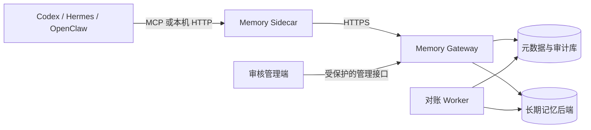

# Agent Memory Gateway

<p align="center">
  <strong>让多个 Agent 在清晰授权下共用长期记忆。</strong><br>
  记忆有来源、有边界、可审核，也能在设备暂时离线时安全地继续工作。
</p>

<p align="center">
  <a href="#三分钟体验"></a>
  <a href="#支持的接入方式"></a>
  <a href="#许可证"></a>
  <a href="#三分钟体验"></a>
</p>

Agent Memory Gateway 是一个可自托管的共享记忆服务。它适合 Codex、Hermes、OpenClaw，以及其他支持 MCP 或 HTTP 的 Agent。每台设备只运行一个本机 Sidecar；Sidecar 负责凭据、离线队列和本地接口，Gateway 负责身份确认、工作区权限、审计和记忆生命周期。

如果你只是想先看它能做什么，直接跑本地演示即可。演示不需要 API key、数据库服务器或容器，也不会接触你现有的 Agent、数据库和网络服务。

## 从这里开始

| 你现在想做什么 | 适合走哪条路 | 需要准备什么 |
|---|---|---|
| 先验证两个 Agent 能否共用一条记忆 | [三分钟体验](#三分钟体验) | Python 3.10 或更高版本 |
| 把 Codex、Hermes 或 OpenClaw 接到已部署的 Gateway | [连接正式共享服务](#连接正式共享服务) | 已登记的设备、Agent 和工作区 |
| 在自己的服务器或内网部署服务 | [部署说明](docs/deployment.md) | PostgreSQL、HTTPS 入口和管理权限 |
| 修改功能、运行回归测试 | [开发与验证](docs/development.md) | Python 开发环境 |

## 三分钟体验

下面的命令会创建一个只在本机回环地址监听的 Gateway，并自动完成一次跨 Agent 验证：`demo-codex` 写入一条无敏感信息的记忆，`demo-hermes` 在同一个工作区检索到它。

```powershell
git clone https://github.com/Buildlee/agent-memory-gateway.git
Set-Location agent-memory-gateway
.\scripts\setup-local-demo.ps1
```

首次运行会在仓库中创建 `.local-demo-venv`，只安装本地演示所需依赖；演示数据、临时主体配置和随机令牌保存在 `%LOCALAPPDATA%\agent-memory-gateway-demo`，不会写进 Git 工作区，也不会把令牌打印到终端。脚本结束时会给出 Gateway 地址、进程 ID 和跨 Agent 检索数量。

看到 `status: ready` 且 `cross_agent_results` 大于 0，就说明演示已经完成。Gateway 会继续在后台运行；结束体验时，只需停止脚本输出的那个进程。演示数据会保留，方便你检查或再次使用，脚本不会自动删除任何文件。

```powershell
Stop-Process -Id <脚本输出的 process_id>
```

如果默认端口已被占用，或你希望把演示数据放到别处，可显式指定安全的新目录和端口：

```powershell
.\scripts\setup-local-demo.ps1 `
  -DemoHome "$env:LOCALAPPDATA\agent-memory-gateway-demo-02" `
  -Port 18787
```

这条体验路径使用 SQLite 和临时演示主体，专门用来理解共享记忆的读写和权限边界。它不会替代正式部署中的设备配对、短期令牌、加密离线队列和 PostgreSQL 元数据服务。

## 它如何解决共享记忆的常见问题

多个 Agent 共用长期信息时，最容易失控的是“谁能看、谁写入、这条信息从哪里来、后来有没有被推翻”。这个项目把这些问题放在服务层处理，而不是交给提示词约定：

- 每次读写都根据设备、Agent 安装实例和工作区判断权限。
- 记忆带有来源、证据、时间、状态和审计信息；重复提交不会形成重复记录。
- 普通观察可以先进入审核；冲突、撤销、遗忘和结晶重建都保留历史。
- Sidecar 在设备离线时保存加密队列，网络恢复后按事件 ID 和顺序同步。
- 检索先做授权过滤，再结合关键词、中文 n-gram、本地特征向量、去重和上下文预算返回结果。
- 密码、令牌、私钥和连接串会在写入前被识别；可疑命令式内容只作为数据返回，不会变成 Agent 指令。

## 支持的接入方式

| 接入方式 | 适合的场景 | 从哪里开始 |
|---|---|---|
| Codex MCP | 本机 Codex 需要共享项目或长期偏好 | [Codex 配置示例](examples/codex-mcp.json) |
| Hermes MCP | Hermes 与同一台设备上的其他 Agent 共用记忆 | [Hermes 配置示例](examples/hermes-mcp.json) |
| OpenClaw HTTP | 本地原型、路由层或自定义工作流 | [HTTP 示例](examples/openclaw-http.md) |
| 其他 MCP 客户端 | 已支持标准 MCP 进程配置的 Agent | 参考 [示例说明](examples/README.md) |

## 连接正式共享服务

正式接入需要四个已经登记的名称：Gateway 地址、设备 ID、Agent 安装实例 ID 和工作区 ID。它们分别说明“连到哪里”“哪台设备”“哪个 Agent”“可以共用哪一批记忆”。管理端先完成设备和 Agent 的登记，再在客户端按下面的顺序配置。

1. 生成 Sidecar 的本机加密密钥。文件只应由当前账户读取。

   ```powershell
   memory-gateway sidecar-keygen `
     --output "$env:LOCALAPPDATA\memory-gateway\secrets\sidecar.env"
   ```

2. 启动这台设备唯一的 Sidecar。多个本机 Agent 可以共用它。

   ```powershell
   .\scripts\start-sidecar.ps1 `
     -GatewayUrl "https://memory-gateway.example.internal" `
     -DeviceId "registered-device" `
     -AllowedAgents "codex-desktop,hermes-desktop" `
     -DefaultWorkspace "shared-workspace" `
     -SidecarKeyFile "$env:LOCALAPPDATA\memory-gateway\secrets\sidecar.env"
   ```

3. 复制对应的 MCP JSON 配置，并只替换脚本路径、Agent 安装实例 ID 和默认工作区。不要把 Gateway 令牌、刷新凭据、数据库地址或私钥写进 JSON。

4. 在 Agent 中先调用 `memory_sync_status`，确认本机 Sidecar 在线；再由一个 Agent 写入经过确认的信息，另一个已获授权的 Agent 使用 `memory_search` 或 `memory_context` 检索它。

`DefaultWorkspace` 必须是已经授权给当前设备和 Agent 的工作区。MCP 调用省略 `workspace_id` 时，会使用这个值；若未配置，工具会明确返回 `WORKSPACE_ID_REQUIRED`，不会猜测一个工作区。

完整的参数说明、内部 CA、容器部署、迁移检查和上线核对见 [部署说明](docs/deployment.md) 与 [示例说明](examples/README.md)。

## 系统结构



| 组件 | 负责什么 |
|---|---|
| Agent | 在当前任务中请求上下文、提交候选记忆或处理反馈 |
| Sidecar | 保存本机凭据、加密 outbox 和缓存；只监听本机回环地址 |
| Gateway | 验证身份、判断工作区权限、维护事件账本、提供查询和审核接口 |
| Worker | 重试、跨库对账、死信处理和结晶重建 |
| 数据库与后端 | 分别保存审计与业务元数据、可检索的长期记忆内容 |

## 一条记忆会经历什么

```text
写入事件
  -> 敏感信息与注入检查
  -> 幂等账本
  -> 已确认写入或进入审核
  -> 授权过滤后的检索
  -> 反馈、遗忘、归档或补偿撤销
```

一条稳定记忆可以被整理成“结晶记忆”，用于在有限上下文预算内提供更短、更可靠的参考。结晶页面保留输入引用和版本；来源发生变化后需要显式重建，避免旧摘要悄悄覆盖新事实。

## 安全与数据边界

- Agent 和 MCP 配置不保存 Gateway 刷新凭据、数据库连接串或私钥。
- 请求体中的用户、设备、Agent 和工作区字段只能表达意图，不能自行扩大权限。
- Gateway 在检索候选之前就过滤未授权记录；长期记忆后端不承担权限判断。
- 离线写入保存在加密 outbox 中。已同步数据的清理必须由用户明确确认。
- 内网服务同样使用 HTTPS；从外部网络访问时，通过 VPN、零信任网络或受控隧道进入内网边界。
- 示例、日志和提交前检查都不应包含真实令牌、证书、私钥、连接串、内网地址或用户路径。

## 文档与示例

- [快速上手](docs/quickstart.md)：本地体验、正式接入和常见问题。
- [总体设计](docs/design-v2.md)：身份、权限、同步、审核和检索的实现边界。
- [部署说明](docs/deployment.md)：PostgreSQL、容器、HTTPS、迁移和上线核对。
- [开发与验证](docs/development.md)：测试命令、检索口径和修改约定。
- [导入已有记忆](docs/importing-existing-memory.md)：把已确认的既有资料迁入共享库。
- [接入示例](examples/README.md)：Codex、Hermes、OpenClaw 与本地原型配置。

## 开发与验证

```powershell
python -m venv .venv
.\.venv\Scripts\Activate.ps1
pip install -e ".[mcp,postgres,dev]"
python -m unittest discover -s tests
python -m compileall -q src tests
git diff --check
```

提交前请运行受影响模块的测试和完整测试集，再检查变更中没有本机配置或敏感信息。具体约定见 [开发与验证](docs/development.md)。

## 参与贡献

欢迎提交可复现的问题、脱敏后的改进建议和测试。涉及协议、权限、迁移或安全边界的改动，请同时更新测试和相应文档；不要在 issue、提交信息、示例或日志中粘贴真实凭据。

## 许可证

[MIT](LICENSE)
