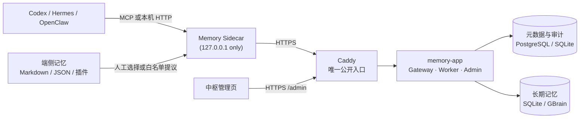

# Agent Memory Gateway

<p align="center">
  <a href="README.md">中文</a>
  ·
  <a href="README_EN.md">English</a>
</p>

<p align="center">
  <strong>让 Codex、Hermes 和未来接入的 Agent 共享真正可用的长期记忆。</strong><br>
  有来源、有权限、可离线、能反馈，也能接住各端原有的个性化记忆。
</p>

<p align="center">
  <a href="#三分钟体验"></a>
  <a href="#接入方式"></a>
  <a href="https://github.com/Buildlee/agent-memory-gateway/actions/workflows/validate.yml"></a>
  <a href="#许可证"></a>
  <a href="#三分钟体验"></a>
</p>

不同 Agent 各自保存记忆时，信息很快会散落在设备、工作区和各自的记忆插件里。Agent Memory Gateway 在它们之间增加一层受控的共享记忆：每台设备只运行一个本机 Sidecar，中枢负责身份、权限、去重、审核、召回和审计。现有 Markdown、JSON、JSONL 或第三方记忆系统不必被替换，可以通过 Provider 按需提议到共享库。

它带来的变化不是“多存一份资料”，而是让 Agent 在回答前先召回跨端积累，并把有用、过时或错误的结果反馈给后续排序。每次召回都有 `recall_id`，管理页能看到哪些设备和 Agent 真正使用了共享记忆，同时不会展示原始查询或端侧文件路径。

## 🚀 快速上手

### 三分钟体验

```powershell
git clone https://github.com/Buildlee/agent-memory-gateway.git
cd agent-memory-gateway
.\scripts\setup-local-demo.ps1
```

做完会看到 `status: ready` 且 `cross_agent_results > 0`。两条演示 Agent（`demo-codex`、`demo-hermes`）在同一个工作区完成了读写验证。Gateway 在后台继续跑，结束时停掉对应进程：

```powershell
Stop-Process -Id <脚本输出的 process_id>
```

演示数据保留在 `%LOCALAPPDATA%\agent-memory-gateway-demo`，不涉及设备和加密同步。默认端口被占用时指定 `-Port` 和 `-DemoHome` 即可。

### 一条命令接入正式服务

管理员生成一次性配对码后，在客户端运行：

```powershell
.\scripts\setup-shared-memory.ps1 -Mode device `
  -GatewayUrl "https://memory-gateway.example.internal" `
  -DeviceId "local-pc" -DefaultWorkspace "shared-workspace" `
  -Agent @("codex-desktop|codex|Codex Desktop", "hermes-desktop|hermes|Hermes Desktop") `
  -InstallAutostart
```

向导完成设备配对、密钥和凭据写入、启动只监听 `127.0.0.1` 的 Sidecar，最后生成 MCP 配置。服务端用 `-Mode server`（加 `-Apply` 执行）。默认是 `memory-app + Caddy` 两个容器；已有的拆分部署仍可作为高隔离模式使用。详见[部署说明](docs/deployment.md)。

## 🔧 系统结构



| 层 | 组件 | 职责 |
|----|------|------|
| 接入层 | Codex / Hermes / OpenClaw | MCP 或 HTTP 请求记忆 |
| 本机层 | Memory Sidecar | 凭据、加密 outbox、缓存，不暴露到局域网 |
| 服务层 | Memory Gateway | 身份验证、权限判断、事件账本、查询和审核 |
| 存储层 | PostgreSQL / SQLite / GBrain | 审计日志、授权信息、可检索的记忆内容 |

正式环境的管理页部署在 Gateway 所在中枢，通过固定 HTTPS `/admin/` 地址访问。浏览器首次完成一次性授权后，会话在有效期内保持；日常可以直接打开该地址。除了审核、设备和运行状态，页面还会展示各 Agent 的实际召回、用户反馈和端侧来源汇总。设备权限变更与撤销都经过确认、版本校验和审计。

## 📦 CLI 命令

| 命令 | 作用 | 示例 |
|------|------|------|
| `memory-gateway` | 启动 HTTP Gateway | `memory-gateway --host 127.0.0.1 --port 8787` |
| `memory-app` | 启动默认一体化服务 | `memory-app` |
| `memory-sidecar-mcp` | MCP Sidecar 桥接 | `memory-sidecar-mcp --transport streamable-http --port 8767` |
| `memory-sidecar-daemon` | 本机 Sidecar 守护进程 | `memory-sidecar-daemon --gateway-url "https://..."` |
| `memory-import` | 导入既有记忆 | `memory-import scan --source ./notes --batch 2026_07` |
| `memory-admin-check` | 管理健康检查 | `memory-admin-check` |
| `memory-admin-console` | 启动管理 Web 页 | `memory-admin-console --port 18700` |

```powershell
pip install -e ".[mcp,postgres]"
memory-gateway --help
```

## 🧩 核心模块

### 服务层

| 模块 | 文件 | 职责 |
|------|------|------|
| HTTP 服务 | `gateway.py` | 健康检查、事件读写、同步 push/pull、审核、管理页 |
| 身份与权限 | `auth.py` | O(1) token hash 认证 + 工作区/能力集权限判断 |
| 加密 Outbox | `outbox.py` | 离线写入加密入列，恢复后按序同步 |
| 同步协议 | `sync_service.py` | push/pull：事件回执、游标增量、墓碑标记 |
| 限流 | `rate_limit.py` | 认证入口滑动窗口限流 |
| 数据库连接池 | `db_pool.py` | PostgreSQL 连接池，支持忙碌回退 |
| 迁移工具 | `migrate.py`, `schema.py` | 数据库版本迁移和 schema 管理 |

### 存储与检索

| 模块 | 文件 | 职责 |
|------|------|------|
| SQLite 存储 | `store.py` | 共享记忆的 SQLite 实现 |
| 元数据账本 | `metadata_store.py` | 事件审计、工作区授权、设备注册 |
| 查询服务 | `query_service.py` | 授权过滤后检索 |
| 反馈服务 | `feedback_service.py` | 记录召回反馈并提供有界排序信号 |
| 混合检索 | `hybrid_retrieval.py` | 关键词 + CJK n-gram + 去重 + 预算裁剪 + MMR 多样性 |
| 评分衰减 | `scoring.py` | 记忆按半衰期衰减（preference 180d / fact 90d / temporary 3d） |
| 向量索引 | `gbrain_backend.py`, `gbrain.py` | 长期记忆的向量检索后端 |
| 结晶记忆 | `crystal_service.py` | 稳定记忆整理为结晶页面，可审计重建 |

### 安全与凭据

| 模块 | 文件 | 职责 |
|------|------|------|
| 安全扫描 | `security.py` | 识别密码/私钥/令牌/连接串，标记命令式内容 |
| 加密 | `crypto.py` | outbox 和同步内容的 AES-GCM 加密 |
| 凭据管理 | `file_credential.py`, `windows_credential.py` | 文件或 Windows Credential Manager 读写 |
| 设备配对 | `device_pair.py`, `device_key.py` | 一次性配对码、设备密钥生成与验证 |

### Sidecar 与管理

| 模块 | 文件 | 职责 |
|------|------|------|
| MCP Sidecar | `sidecar_mcp.py` | 暴露 `memory_context`/`memory_write`/`memory_sync_status` |
| 端侧 Provider | `local_provider.py` | 读取本机记忆并安全提议到共享库 |
| 本机 Daemon | `sidecar_daemon.py` | 单实例，多 Agent 通过回环 RPC 共用 |
| 审核服务 | `review_service.py` | 待审核观察与审批工作流 |
| 管理控制台 | `admin_console.py`, `admin_check.py` | 本机备用入口、中枢 Web 管理页和健康检查 |
| 导入工具 | `importer.py` | 把既有资料导入共享库 |

### 一条记忆的处理流程

```
写入 → 敏感检查(security.py) → 幂等去重(metadata_store.py) → 确认/审核
  → 授权过滤检索(query_service.py + hybrid_retrieval.py) → recall_id → 反馈/遗忘/归档/撤销
```

稳定记忆可整理为结晶页（`crystal_service.py`），来源变化后需显式重建。

## 🔒 安全边界

- Agent 配置不保存 Gateway 刷新凭据、数据库连接串或私钥
- 请求体字段只能声明意图，不能自行扩大权限
- Gateway 在检索前过滤未授权记录，后端不承担权限判断
- 离线写入经过加密 outbox，同步后清理需用户确认
- 内网服务同样使用 HTTPS；外网通过 VPN / 零信任 / 受控隧道接入
- 示例和日志不包含真实令牌、证书、私钥、连接串或内网地址

## 🔌 接入方式

| 方式 | 场景 | 参考 |
|------|------|------|
| Codex MCP | 本机 Codex 共享项目/偏好 | [codex-mcp.json](examples/codex-mcp.json) |
| Hermes MCP | 同设备多 Agent 共用 | [hermes-mcp.json](examples/hermes-mcp.json) |
| OpenClaw HTTP | 本地原型或自定义工作流 | [openclaw-http.md](examples/openclaw-http.md) |
| 标准 MCP 客户端 | 支持 MCP 的 Agent | [示例说明](examples/README.md) |
| 容器内 Agent | Docker + Streamable HTTP MCP | [容器 Sidecar](docs/container-sidecar.md) |

## 📖 文档

- [快速上手](docs/quickstart.md) — 本地体验、正式接入、常见问题
- [总体设计](docs/design-v2.md) — 身份、权限、同步、审核和检索的实现边界
- [部署说明](docs/deployment.md) — PostgreSQL、HTTPS、迁移、上线核对
- [中枢管理页](docs/central-admin.md) — 在 Gateway 所在环境部署和打开 `/admin`
- [日常运维与恢复](docs/operations.md) — 管理页、运行检查、死信排查、恢复演练
- [开发与验证](docs/development.md) — 测试命令、检索口径、修改约定
- [导入已有记忆](docs/importing-existing-memory.md) — 把既有资料迁入共享库
- [容器 Agent 接入](docs/container-sidecar.md) — 通用 Docker Sidecar 和 MCP Bridge

## 🔨 开发

```powershell
python -m venv .venv
.\.venv\Scripts\Activate.ps1
pip install -e ".[mcp,postgres,dev]"
python -m pytest tests/ -v
```

提交前跑完整测试和编译检查，具体约定见[开发与验证](docs/development.md)。

```powershell
python -m unittest discover -s tests
python -m compileall -q src tests
git diff --check
```

## 🤝 参与贡献

欢迎提交可复现的问题和脱敏后的改进建议。涉及协议、权限、迁移或安全边界的改动请同步更新测试和文档。不要在 issue、提交信息、示例或日志中粘贴真实凭据。

## 📄 许可证

[MIT](LICENSE)
