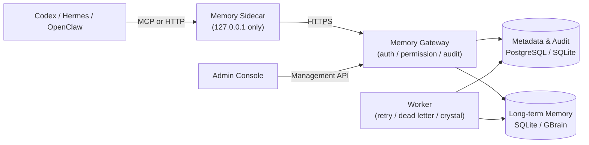

# Agent Memory Gateway

<p align="center">
  <strong>Shared long-term memory for multiple agents — every read and write is sourced, authorized, and auditable.</strong><br>
  Offline queue, encrypted sync, sensitive content detection, out of the box.
</p>

<p align="center">
  <a href="README.md">中文</a>
  ·
  <a href="README_EN.md">English</a>
</p>

<p align="center">
  <a href="#3-minute-demo"></a>
  <a href="#access-methods"></a>
  <a href="https://github.com/Buildlee/agent-memory-gateway/actions/workflows/validate.yml"></a>
  <a href="#license"></a>
  <a href="#3-minute-demo"></a>
</p>

When multiple agents run independently, sharing long-term memory across devices raises a few questions: who wrote what, who can see it, what happens offline, how to deduplicate. This project turns shared memory into a standalone service — no prompt conventions required. Each device runs one local Sidecar; the Gateway handles auth, permissions, audit, and memory lifecycle. 45 Python modules and 46 test files, with both SQLite and PostgreSQL backends.

## 🚀 Quick start

### 3-minute demo

```powershell
git clone https://github.com/Buildlee/agent-memory-gateway.git
cd agent-memory-gateway
.\scripts\setup-local-demo.ps1
```

You'll see `status: ready` and `cross_agent_results > 0`. Two demo agents (`demo-codex`, `demo-hermes`) performed a write and cross-retrieval in the same workspace. The Gateway runs in the background; stop it when done:

```powershell
Stop-Process -Id <process_id from script output>
```

Demo data stays in `%LOCALAPPDATA%\agent-memory-gateway-demo`. No device pairing or encrypted sync involved. If the default port is taken, specify `-Port` and `-DemoHome`.

### One-command production setup

After the admin generates a one-time pairing code, run on the client:

```powershell
.\scripts\setup-shared-memory.ps1 -Mode device `
  -GatewayUrl "https://memory-gateway.example.internal" `
  -DeviceId "local-pc" -DefaultWorkspace "shared-workspace" `
  -Agent @("codex-desktop|codex|Codex Desktop", "hermes-desktop|hermes|Hermes Desktop") `
  -InstallAutostart
```

The wizard completes device pairing, key generation, credential storage, starts the Sidecar (listening on `127.0.0.1`), and generates MCP config files. For first-time server deployment, use `-Mode server` with `-Apply`. See [deployment guide](docs/en/deployment.md).

## 🔧 Architecture



| Layer | Component | Responsibility |
|-------|-----------|---------------|
| Access | Codex / Hermes / OpenClaw | Request memory via MCP or HTTP |
| Local | Memory Sidecar | Credentials, encrypted outbox, cache; not exposed to LAN |
| Service | Memory Gateway | Auth, permissions, event ledger, query and review APIs |
| Storage | PostgreSQL / SQLite / GBrain | Audit logs, authorization data, retrievable memory |

## 📦 CLI commands

| Command | Description | Example |
|---------|-------------|---------|
| `memory-gateway` | Start HTTP Gateway | `memory-gateway --host 127.0.0.1 --port 8787` |
| `memory-sidecar-mcp` | MCP Sidecar bridge | `memory-sidecar-mcp --transport streamable-http --port 8767` |
| `memory-sidecar-daemon` | Local Sidecar daemon | `memory-sidecar-daemon --gateway-url "https://..."` |
| `memory-import` | Import existing memory | `memory-import scan --source ./notes --batch 2026_07` |
| `memory-admin-check` | Admin health check | `memory-admin-check` |
| `memory-admin-console` | Start admin web UI | `memory-admin-console --port 18700` |

```powershell
pip install -e ".[mcp,postgres]"
memory-gateway --help
```

## 🧩 Core modules

### Service layer

| Module | File | Responsibility |
|--------|------|---------------|
| HTTP Gateway | `gateway.py` | Health checks, event CRUD, sync push/pull, review, admin pages |
| Auth & Permissions | `auth.py` | O(1) token hash authentication + workspace/capability checks |
| Encrypted Outbox | `outbox.py` | Encrypt offline writes, sync in order when back online |
| Sync Protocol | `sync_service.py` | Push/pull: per-event receipts, cursor increments, tombstone markers |
| Rate Limiter | `rate_limit.py` | Sliding-window rate limiter for auth endpoints |
| DB Pool | `db_pool.py` | PostgreSQL connection pool with busy fallback |
| Migration | `migrate.py`, `schema.py` | Schema versioning and migration |

### Storage & Retrieval

| Module | File | Responsibility |
|--------|------|---------------|
| SQLite Store | `store.py` | SQLite shared memory storage |
| Metadata Ledger | `metadata_store.py` | Event audit, workspace authorization, device registration |
| Query Service | `query_service.py` | Authorized memory retrieval |
| Hybrid Retrieval | `hybrid_retrieval.py` | Keyword + CJK n-gram + dedup + token budget + MMR diversity |
| Scoring | `scoring.py` | Half-life decay scoring (preference 180d / fact 90d / temporary 3d) |
| Vector Index | `gbrain_backend.py`, `gbrain.py` | Vector search backend for long-term memory |
| Crystal Memory | `crystal_service.py` | Stable memory pages, auditable reconstruction |

### Security & Credentials

| Module | File | Responsibility |
|--------|------|---------------|
| Security Scanner | `security.py` | Detect passwords, private keys, tokens, connection strings; flag instruction-like content |
| Encryption | `crypto.py` | AES-GCM encryption for outbox and sync |
| Credential Store | `file_credential.py`, `windows_credential.py` | Read/write credentials from files or Windows Credential Manager |
| Device Pairing | `device_pair.py`, `device_key.py` | One-time pairing codes, device key generation |

### Sidecar & Admin

| Module | File | Responsibility |
|--------|------|---------------|
| MCP Sidecar | `sidecar_mcp.py` | Expose `memory_context`/`memory_write`/`memory_sync_status` tools |
| Local Daemon | `sidecar_daemon.py` | Single instance, shared via loopback RPC |
| Review Service | `review_service.py` | Pending observation and approval workflow |
| Admin Console | `admin_console.py`, `admin_check.py` | Local web admin UI and health checks |
| Import Tool | `importer.py` | Import existing data into the shared library |

### Memory lifecycle

```
Write → sensitive check (security.py) → idempotent dedup (metadata_store.py) → confirm / review
  → authorized retrieval (query_service.py + hybrid_retrieval.py) → feedback / forget / archive / revoke
```

Stable memories can be compiled into crystal pages (`crystal_service.py`), rebuilt explicitly when source facts change.

## 🔒 Security boundaries

- Agent config never stores Gateway refresh tokens, database connection strings, or private keys
- Request body fields express intent only; they cannot escalate privileges
- Gateway filters unauthorized records before retrieval; backends don't handle auth decisions
- Offline writes go through the encrypted outbox; post-sync cleanup requires user confirmation
- Internal services use HTTPS too; external access goes through VPN / zero-trust / controlled tunnel
- Examples and logs contain no real tokens, certificates, private keys, connection strings, or internal addresses

## 🔌 Access methods

| Method | Use case | Reference |
|--------|----------|-----------|
| Codex MCP | Local Codex sharing project context / preferences | [codex-mcp.json](examples/codex-mcp.json) |
| Hermes MCP | Multi-agent on the same device | [hermes-mcp.json](examples/hermes-mcp.json) |
| OpenClaw HTTP | Local prototyping or custom workflow | [openclaw-http.md](examples/openclaw-http.md) |
| Standard MCP client | Any MCP-compatible agent | [examples README](examples/en/README.md) |
| Container agent | Docker service + Streamable HTTP MCP | [container sidecar](docs/en/container-sidecar.md) |

## 📖 Documentation

- [Quick start](docs/en/quickstart.md) — Local demo, production setup, FAQ
- [Design](docs/en/design-v2.md) — Identity, permissions, sync, review, retrieval boundaries
- [Deployment](docs/en/deployment.md) — PostgreSQL, HTTPS, migration, go-live checklist
- [Operations](docs/en/operations.md) — Admin UI, health checks, dead letters, recovery drills
- [Development](docs/en/development.md) — Test commands, retrieval specs, contribution conventions
- [Importing existing memory](docs/en/importing-existing-memory.md) — Migrate existing data into the shared library
- [Container agent](docs/en/container-sidecar.md) — Docker Sidecar and MCP Bridge

## 🔨 Development

```powershell
python -m venv .venv
.\.venv\Scripts\Activate.ps1
pip install -e ".[mcp,postgres,dev]"
python -m pytest tests/ -v
```

Before committing:

```powershell
python -m unittest discover -s tests
python -m compileall -q src tests
git diff --check
```

See [development guide](docs/en/development.md) for details.

## 🤝 Contributing

File reproducible issues and anonymized improvement suggestions. Changes touching protocol, permissions, migration, or security boundaries must update tests and docs. Do not paste real credentials into issues, commits, examples, or logs.

## 📄 License

[MIT](LICENSE)
