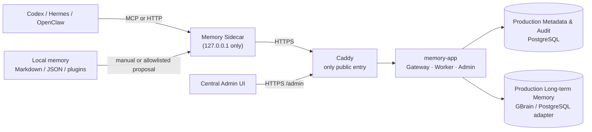

# Agent Memory Gateway

<p align="center">
  <strong>Useful shared long-term memory for Codex, Hermes, and the agents you add next.</strong><br>
  Sourced, authorized, offline-capable, feedback-aware, and compatible with local memory stores.
</p>

<p align="center">
  <a href="README.md">中文</a>
  ·
  <a href="README_EN.md">English</a>
</p>

<p align="center">
  <a href="#3-minute-demo"></a>
  <a href="#access-methods"></a>
  <a href="https://github.com/Buildlee/agent-memory-gateway/actions/workflows/validate.yml"></a>
  <a href="#license"></a>
  <a href="#3-minute-demo"></a>
</p>

When every agent keeps its own memory, useful context becomes fragmented across devices, workspaces, and plugins. Agent Memory Gateway adds a controlled shared layer between them. Each device runs one local Sidecar; the central service handles identity, permissions, deduplication, review, recall, and audit. Existing Markdown, JSON, JSONL, or third-party stores do not need to be replaced: a Provider can propose selected records to the shared library.

The value is not another archive. Agents recall cross-device knowledge before answering, then report whether the result was useful, stale, or incorrect. Every recall has a `recall_id`, and the admin console shows which agents actually benefit without exposing raw queries or local file paths.

## 🚀 Quick start

### 3-minute demo

```powershell
git clone https://github.com/Buildlee/agent-memory-gateway.git
cd agent-memory-gateway
.\scripts\setup-local-demo.ps1
```

You'll see `status: ready` and `cross_agent_results > 0`. Two demo agents (`demo-codex`, `demo-hermes`) performed a write and cross-retrieval in the same workspace. The Gateway runs in the background; stop it when done:

```powershell
Stop-Process -Id <process_id from script output>
```

Demo data stays in `%LOCALAPPDATA%\agent-memory-gateway-demo`. No device pairing or encrypted sync involved. If the default port is taken, specify `-Port` and `-DemoHome`.

### One-command production setup

Clients support Windows, Linux, and macOS. The installer guides the user through Gateway, workspace, and Agent selection, then reads the one-time pairing code through hidden input. Windows uses a per-user scheduled task, Linux uses a systemd user service, and macOS uses a LaunchAgent.

Create the one-time pairing code with the smallest workspace capabilities needed by the new device. The binding is stored in the code and applied atomically during pairing, so the first sync does not require a separate per-Agent administration step:

```powershell
memory-gateway pairing-code `
  --tenant-id personal --user-id user-a --device-type windows --agent-types codex,hermes,openclaw `
  --workspace-id agent-memory-gateway `
  --capabilities memory.feedback,memory.forget,memory.read_context,memory.search,memory.sync,memory.write_event
```

After the admin generates a one-time pairing code, run on Windows:

```powershell
& ([scriptblock]::Create((irm https://raw.githubusercontent.com/Buildlee/agent-memory-gateway/main/scripts/memory-device-install.ps1)))
```

Linux / macOS:

```bash
curl -fsSL --proto '=https' --tlsv1.2 https://raw.githubusercontent.com/Buildlee/agent-memory-gateway/main/scripts/memory-device-install.sh | sh
```

The wizard detects Codex, Hermes, and OpenClaw, completes device pairing, stores credentials, starts the loopback-only Sidecar, and generates the client-specific MCP files. It reports `ready` only after the first Agent completes a Gateway sync. Merge the generated `shared-memory` entry into each Agent's MCP configuration and restart that Agent; the installer does not silently rewrite third-party client settings.

Maintenance uses the same CLI:

```powershell
memory-device status
memory-device doctor
memory-device repair          # preview by default; add --apply to repair
memory-device upgrade --package <verified source directory or wheel> --release-id v0.2.0
memory-device rollback        # preview by default; add --yes to roll back
memory-device uninstall       # preview by default; add --yes to uninstall
```

The installer uses the latest stable GitHub Release manifest by default and verifies the source archive SHA-256. If no stable release exists, an interactive run asks before using development `main`; declining or running non-interactively stops the install, so fallback is never silent. Development testing can explicitly use `-Channel development` on Windows or `MEMORY_DEVICE_CHANNEL=development` on Linux/macOS. A pinned release in the installation profile still takes precedence.

Upgrade installs into a separate versioned runtime, switches the service and MCP configuration only after staging succeeds, then checks Sidecar health. A failed health check automatically reactivates the previous runtime. `rollback --yes` returns to that retained version. Uninstall keeps credentials and local memory unless `--purge-credentials` or `--purge-data` is explicitly selected.

On Linux or macOS, use the installed cross-platform CLI:

```powershell
memory-device install --profile ./device-install.json
```

It reads the pairing code through hidden input, stores the refresh credential in an owner-only file, and registers a systemd user service or LaunchAgent. Add `--resume` after an interruption; a conflicting existing file stops the install instead of being overwritten.

## 🔧 Architecture


```mermaid
flowchart LR
  A["Codex / Hermes / OpenClaw"] -->|MCP or HTTP| S["Memory Sidecar<br/>(127.0.0.1 only)"]
  S -->|HTTPS| P["Caddy<br/>only public entry"]
  P --> APP["memory-app<br/>Gateway · Worker · Admin"]
  APP --> M[("Production Metadata & Audit<br/>PostgreSQL")]
  APP --> B[("Production Long-term Memory<br/>GBrain / PostgreSQL adapter")]
  L["Local memory<br/>Markdown / JSON / plugins"] -->|"manual or allowlisted proposal"| S
  R["Central Admin UI"] -->|"HTTPS /admin"| P
```

| Layer | Component | Responsibility |
|-------|-----------|---------------|
| Access | Codex / Hermes / OpenClaw | Request memory via MCP or HTTP |
| Local | Memory Sidecar | Credentials, encrypted outbox, cache; not exposed to LAN |
| Service | Memory Gateway | Auth, permissions, event ledger, query and review APIs |
| Storage | PostgreSQL + GBrain/adapter; encrypted Sidecar SQLite | Central audit, authorization, and shared memory; local outbox, cache, and checkpoints; the Gateway SQLite shared store is demo-only |

The default `slim` profile runs Gateway, Worker, admin Sidecar, and console in one application container while filtering sensitive environment variables per child process. This is an operationally compact profile, not container-level isolation; use `split` when stronger failure-domain and filesystem isolation is required.

In production, the admin UI runs beside the Gateway and is reached through a fixed HTTPS `/admin/` address. A browser completes a one-time authorization, then keeps a signed session across `admin-console` restarts until it expires. The device page can update workspace permissions or revoke an untrusted identity, Activity shows the source device and Agent, and every change is confirmed, concurrency-checked, and audited.

## 📦 CLI commands

| Command | Description | Example |
|---------|-------------|---------|
| `memory-gateway` | Start HTTP Gateway | `memory-gateway --host 127.0.0.1 --port 8787` |
| `memory-app` | Start the default integrated service | `memory-app` |
| `memory-sidecar-mcp` | MCP Sidecar bridge | `memory-sidecar-mcp --transport streamable-http --port 8767` |
| `memory-sidecar-daemon` | Local Sidecar daemon | Run `memory-sidecar-daemon` after setting `MEMORY_DEVICE_RUNTIME_CONFIG` |
| `memory-device` | Device setup, diagnostics, repair, upgrade, rollback, and uninstall | `memory-device onboard`, `memory-device doctor` |
| `memory-import` | Import existing memory | `memory-import scan --source ./notes --batch 2026_07` |
| `memory-admin-check` | Admin health check | `memory-admin-check` |
| `memory-admin-console` | Start admin web UI | `memory-admin-console --port 18700` |

```powershell
pip install -e ".[mcp,postgres]"
memory-gateway --help
```

## 🧩 Core modules

### Service layer

| Module | File | Responsibility |
|--------|------|---------------|
| HTTP Gateway | `gateway.py` | Health checks, event CRUD, sync push/pull, review, admin pages |
| Auth & Permissions | `auth.py` | O(1) token hash authentication + workspace/capability checks |
| Encrypted Outbox and checkpoints | `outbox.py` | Sync offline writes in order; store layered task summaries and details encrypted locally |
| Sync Protocol | `sync_service.py` | Push/pull: per-event receipts, cursor increments, tombstone markers |
| Rate Limiter | `rate_limit.py` | Sliding-window rate limiter for auth endpoints |
| DB Pool | `db_pool.py` | PostgreSQL connection pool with busy fallback |
| Migration | `migrate.py`, `schema.py` | Schema versioning and migration |

### Storage & Retrieval

| Module | File | Responsibility |
|--------|------|---------------|
| SQLite Store | `store.py` | SQLite shared memory storage |
| Metadata Ledger | `metadata_store.py` | Event audit, workspace authorization, device registration |
| Query Service | `query_service.py` | Authorized memory retrieval |
| Feedback Service | `feedback_service.py` | Store recall feedback and produce bounded ranking signals |
| Hybrid Retrieval | `hybrid_retrieval.py` | Keyword + CJK n-gram + dedup + token budget + MMR diversity |
| Decay observation | `scoring.py` | Compute hot/warm/cold/dead shadow results without changing production ranking |
| Vector Index | `gbrain_backend.py`, `gbrain.py` | Vector search backend for long-term memory |
| Crystal Memory | `crystal_service.py` | Plan rebuild candidates in the worker; rebuild explicitly and auditably |

### Security & Credentials

| Module | File | Responsibility |
|--------|------|---------------|
| Security Scanner | `security.py` | Detect passwords, private keys, tokens, connection strings; flag instruction-like content |
| Encryption | `crypto.py` | AES-GCM encryption for outbox and sync |
| Credential Store | `file_credential.py`, `windows_credential.py` | Read/write credentials from files or Windows Credential Manager |
| Device Pairing | `device_pair.py`, `device_key.py` | One-time pairing codes, device key generation |

### Sidecar & Admin

| Module | File | Responsibility |
|--------|------|---------------|
| MCP Sidecar | `sidecar_mcp.py` | Expose standard context, long-term memory, checkpoint, and resume tools |
| Local Providers | `local_provider.py` | Read local stores and safely propose selected records |
| Local Daemon | `sidecar_daemon.py` | Single instance, shared via loopback RPC |
| Review Service | `review_service.py` | Pending observation and approval workflow |
| Admin Console | `admin_console.py`, `admin_check.py` | Local fallback UI, central web admin UI, and health checks |
| Import Tool | `importer.py` | Import existing data into the shared library |

### Memory lifecycle

```
Write → sensitive check (security.py) → idempotent dedup (metadata_store.py) → confirm / review
  → authorized retrieval (query_service.py + hybrid_retrieval.py) → recall_id → feedback / forget / archive / revoke
```

Stable memories can be compiled into crystal pages (`crystal_service.py`), rebuilt explicitly when source facts change.

Long-running tasks do not require access to an Agent's private session files. Any standard MCP client can call `memory_checkpoint` to save conclusions, next steps, blockers, and references in the encrypted local store, then call `memory_resume` later. Resume returns the short skeleton by default and decrypts details only with `include_details=true`. Checkpoints are not uploaded to the Gateway or converted into shared long-term memories automatically.

The daily core tools are `memory_context`, `memory_remember`, `memory_checkpoint`, `memory_resume`, and `memory_sync_status`. Their parameters and behavior are identical across MCP clients.

The worker creates crystal rebuild candidates from confirmed source references. `memory_list_crystal_candidates` returns only scope, references, and revisions; `memory_rebuild_crystal` remains explicit. Production results include `shadow_decay.applied: false` for observation only, so decay does not affect current ranking.

## 🔒 Security boundaries

- Agent config never stores Gateway refresh tokens, database connection strings, or private keys
- Request body fields express intent only; they cannot escalate privileges
- Gateway filters unauthorized records before retrieval; backends don't handle auth decisions
- Offline writes go through the encrypted outbox; post-sync cleanup requires user confirmation
- Internal services use HTTPS too; external access goes through VPN / zero-trust / controlled tunnel
- Examples and logs contain no real tokens, certificates, private keys, connection strings, or internal addresses

## 🔌 Access methods

| Method | Use case | Reference |
|--------|----------|-----------|
| Standard MCP client | All core features; no Agent-specific plugin or hook required | [examples README](examples/en/README.md) |
| Codex MCP template | Connect Codex to the same MCP service | [codex-mcp.json](examples/codex-mcp.json) |
| Hermes MCP template | Connect Hermes to the same MCP service | [hermes-mcp.json](examples/hermes-mcp.json) |
| OpenClaw MCP template | Connect OpenClaw to the same MCP service | [openclaw-mcp.json](examples/openclaw-mcp.json) |
| OpenClaw HTTP | Local prototyping or custom workflow | [openclaw-http.md](examples/openclaw-http.md) |
| Container agent | Docker service + Streamable HTTP MCP | [container sidecar](docs/en/container-sidecar.md) |

## 📖 Documentation

- [Quick start](docs/en/quickstart.md) — Local demo, production setup, FAQ
- [Design](docs/en/design-v2.md) — Identity, permissions, sync, review, retrieval boundaries
- [Deployment](docs/en/deployment.md) — PostgreSQL, HTTPS, migration, go-live checklist
- [Central Admin UI](docs/en/central-admin.md) — Deploy and open `/admin` beside the Gateway
- [Operations](docs/en/operations.md) — Admin UI, health checks, dead letters, recovery drills
- [Development](docs/en/development.md) — Test commands, retrieval specs, contribution conventions
- [Importing existing memory](docs/en/importing-existing-memory.md) — Migrate existing data into the shared library
- [Container agent](docs/en/container-sidecar.md) — Docker Sidecar, MCP Bridge, and post-recreate reconciliation

## 🔨 Development

```powershell
python -m venv .venv
.\.venv\Scripts\Activate.ps1
pip install -e ".[mcp,postgres,dev]"
python -m pytest tests/ -v
```

Before committing:

```powershell
python -m unittest discover -s tests
python -m compileall -q src tests
git diff --check
```

See [development guide](docs/en/development.md) for details.

## 🤝 Contributing

File reproducible issues and anonymized improvement suggestions. Changes touching protocol, permissions, migration, or security boundaries must update tests and docs. Do not paste real credentials into issues, commits, examples, or logs.

## 📄 License

[MIT](LICENSE)
