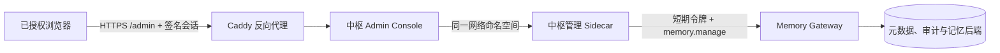

# 中枢管理页

管理页部署在 Gateway 和元数据存储所在的飞牛环境。设备、审核、死信和活动记录从同一个服务边界读取。本机仍保留回环管理页，离线维护时用。



控制台不连数据库，不保存 Gateway 令牌、凭据或私钥，只能通过 Sidecar 调 Gateway 已有的授权接口。

## 页面功能

打开管理页后看到六个标签：

**概览** — 待审核数、重试事件、死信、活跃设备四个指标卡。下面列出优先级任务和一小时内活动预览。

**记忆** — 默认展示当前工作区全部共享记忆，不要求输关键词。每条记忆标注来源设备/Agent、生命周期状态（active/superseded/archived）、置信度。被取代的记忆显示取代它的引用。输入两个以上字符可以搜索。

**图谱** — Canvas 绘制的实体关系网络。记忆为蓝色节点，设备为橙色，Agent 为紫色。连线表示"来源于"关系，虚线是被取代的旧事实。归档记忆半透明显示。

**审核** — 待处理的候选记忆。可以确认、编辑确认、保留双方、取代或拒绝。每次操作需显式勾选确认。

**设备与权限** — 所有已登记设备，含在线指示。亮绿圆点表示最近五分钟内出现过的设备；灰色表示离线。可展开各设备的权限标签修改能力分配。

**运行** — 同步投递状态、重试事件和死信。只读，不提供自动重放或删除。

**活动** — 审计记录。可按设备/Agent/操作搜索，按结果类型筛选，每页 10/20/50 条翻页。点击 `gbrain:fact:xxx` 目标引用会跳到对应记忆详情。

## 首次配置

先发布包含 `deploy/fn/admin-console.compose.yaml` 的 Gateway 版本，确认 Gateway、Worker 和代理健康。然后在 Windows 上做只读预检：

```powershell
.\scripts\setup-central-admin.ps1 `
  -SshHost "deploy-user@nas" `
  -SshPort 22 `
  -RemoteRoot "/srv/memory-gateway" `
  -StateDirectory "/srv/memory-gateway/admin" `
  -TenantId "tenant" `
  -UserId "administrator" `
  -DeviceId "memory-admin" `
  -AgentInstallationId "memory-admin" `
  -DefaultWorkspace "shared-workspace" `
  -PublicBaseUrl "https://memory-gateway.internal:8443/admin"
```

预检只核对 Gateway、发布副本、Docker 网络、目标目录和现有容器，不会创建身份、写凭据或替换容器。确认输出后加 `-Apply`。首次执行会：

- 登记独立的中枢管理设备与 Agent，只授指定工作区权限，默认含 `memory.manage`。
- 把设备密钥、刷新凭据和 Sidecar key 写入受保护目录（权限 `0600`）。这些内容不打印、不进 Git。
- 只启动 `admin-sidecar` 和 `admin-console`，不改 Hermes、数据库或现有 Bridge。

已有管理身份或容器时脚本拒绝覆盖，需显式加 `-Resume`。

## 打开页面

固定入口是部署时配置的 HTTPS 地址，如 `https://192.168.100.144:8443/admin/`。首次授权后 30 天内直接打开；容器重启不会让会话失效。

授权过期或换了浏览器后运行：

```powershell
.\scripts\open-central-admin.ps1 `
  -SshHost "deploy-user@nas" `
  -RemoteRoot "/srv/memory-gateway" `
  -StateDirectory "/srv/memory-gateway/admin"
```

脚本重建 `admin-console` 容器，产生一次性链接交给浏览器。链接不回显到 PowerShell、日志或 Docker 输出。首个请求换成签名过期的 `HttpOnly`、`Secure`、`SameSite=Strict` Cookie，路径限定 `/admin`。签名密钥在中枢状态目录，不进浏览器、日志或 Git。

没有有效 Cookie 时页面显示"需要授权此浏览器"，不会返回 JSON 错误。

## 网络与权限

- Caddy 是唯一对浏览器开放的入口。`admin-console` 没有宿主机端口，`admin-sidecar` 的 RPC 只监听容器回环地址。
- 只在内网或 VPN 内访问 `/admin`。不要对外映射或关 TLS。
- 中枢管理身份与 Codex、Hermes 彼此独立。用同一套设备登记与工作区授权模型。
- 页面不展示公钥原文、凭据、连接串、令牌或记忆密文。
- 设备页可调整工作区能力、撤销 Agent 或设备。操作需二次确认和当前授权版本。管理端不能撤销自身或移除自己的 `memory.manage`。
- 撤销只让身份和凭据失效，不删除记忆、设备记录或审计。恢复需重新登记或配对。

## 验收

1. Gateway、Worker、代理和 `admin-sidecar` 均为 healthy/running。
2. 首次通过打开脚本授权浏览器；关闭页面后直接访问固定地址，无需再跑命令。
3. 概览、记忆、图谱、审核、设备、运行、活动七个标签均可读取和交互。
4. 记忆页默认展示全部共享记忆，含来源设备、Agent 和生命周期状态。
5. 设备列表上活跃设备显示绿色圆点，离线设备显示灰色圆点。
6. 活动页翻页正常，点击 `gbrain:fact:` 引用能跳到对应记忆。
7. 图谱页显示记忆-设备-Agent 关系网络，取代关系为虚线。
8. 验证一次权限修改和一次审核确认，确认审计有记录。
