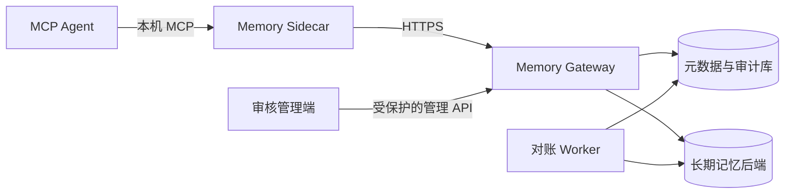

# 多 Agent 共享记忆系统设计

适用于支持 MCP 或 HTTP 的 Agent，可从单机原型扩展到多设备自托管部署。

这份文档只说明可复用的系统设计。域名、IP、账号、数据库地址、证书指纹、现场记录和密钥不应写入这里。

## 从体验到正式接入

仓库提供两条入口：

- **本地体验脚本**：SQLite + 临时主体，两个 Agent 跨 Agent 检索，数据留在本机。
- **正式接入**：设备绑定、Sidecar、HTTPS、已登记工作区连接共享服务。

两条入口遵循相同的身份、工作区、审计、检索规则。前者不承担跨设备安全与高可用职责；后者使用 PostgreSQL 元数据库、加密 outbox、显式迁移流程。具体操作见 [快速上手](quickstart.md) 和 [部署说明](deployment.md)。

---

### 安装向导收拢步骤，不替人跳过确认

`scripts/setup-shared-memory.ps1` 提供五种模式：

| 模式 | 用途 |
|------|------|
| `demo` | 本地体验 |
| `server` | 发布已准备好的服务端版本 |
| `device` | Windows 设备配对并接入 Sidecar |
| `container` | 容器端 Sidecar 设置 |
| `verify` | 检查本机 Sidecar 是否在运行 |

`device` 模式从隐藏输入读取一次性配对码，创建设备私钥和 Sidecar key，刷新凭据存入 Windows Credential Manager。默认建立独立 Python 运行环境，启动后只生成不含凭据的 MCP JSON。已有私钥、key、计划任务或 MCP 配置时停止，不会覆盖。配对成功但本机后续步骤被打断时，用户可传 `-UseExistingCredential` 继续；脚本只复用受保护存储中的现有凭据，不读取、替换或输出它。

`server` 模式不带 `-Apply` 时只回显经校验的发布信息。加 `-Apply` 才会创建发布目录、上传公开代码、启动容器。密钥、证书、数据库迁移和备份不属于自动化范围：这些动作需要管理员在维护窗口确认。

---

## 什么会进入共享库

共享库保存长期信息：已确认的偏好、项目决定、设备事实、经审核的工作区知识。每条记录带来源、所属工作区、状态和审计信息。

以下内容留在原地：Agent 完整会话记录、项目文件、工具运行状态、模型即时上下文。系统不会把所有聊天内容自动沉淀为长期记忆。

客户端通过 Gateway 读写数据，不能直连数据库。部署不依赖某一家 Agent、公网服务或第三方向量 API。

---

## 一条记忆如何经过系统



### 组件职责

| 组件 | 日常工作 | 边界 |
|------|----------|------|
| MCP Agent | 调用记忆工具，结果交给当前任务 | 不保存 Gateway 凭据，不直连数据库 |
| Sidecar | 管理本机认证、加密 outbox、缓存、离线同步 | 每台设备只启动一个，供多个 Agent 共用 |
| Gateway | 验证身份、判断权限、接收事件、检索与审核接口 | 不保存完整会话历史 |
| Worker | 重试、跨库对账、死信处理、后台结晶 | 不对 Agent 暴露接口 |
| 元数据库 | 绑定、事件账本、回执、审核、同步状态、审计 | 不充当聊天记录仓库 |
| 长期记忆后端 | 已确认记忆、检索索引、引用 | 不承担身份认证或公网入口 |

Sidecar 是每台设备唯一的本机状态所有者。同一设备多个 Agent 共享一个 Sidecar，避免两个进程同时维护离线队列。

Sidecar 启动时写明默认工作区。MCP 工具没有 `workspace_id` 时使用这个值；它不替调用者绕过 Gateway 的工作区授权。

---

### 同一接入协议覆盖不同设备

设备接入分两层：

- **协议层**：配对、设备私钥、刷新凭据轮换、工作区绑定、离线队列、MCP 工具。行为不因设备品牌或 Agent 厂商变化。
- **运行层**：本机凭据保存和进程生命周期。Windows 用 Credential Manager + 计划任务；容器用权限 `0600` 的状态目录 + 回环 MCP Bridge。

容器 Bridge 与目标服务共用网络命名空间，标准地址固定为 `http://127.0.0.1:8767/mcp`。需要适配的只是 Agent 官方 MCP 设置入口，不需要重新实现记忆服务。配置连接器不能保存刷新凭据、操作数据库或扩大工作区权限。

---

## 谁能看到哪些记忆

### 系统确认调用者

有效主体由以下边界共同确定：租户、用户、设备、Agent 安装实例、工作区。请求体中的字段只表达意图，不能单独作为授权依据。

初次接入用一次性配对码 + 设备公钥完成绑定。设备以 **Ed25519** 证明私钥持有；Gateway 发放短期访问令牌，刷新凭据仅保存在受操作系统保护的本机位置。配对码不进入命令行、PowerShell 历史或 MCP JSON。撤销设备或 Agent 时递增对应 epoch，旧令牌和旧同步状态立即失效。

### 每次请求的判断顺序

1. 验证调用者身份和令牌（SHA-256 token hash，O(1) 查找）。
2. 根据登记绑定关系确定可见工作区。
3. 检索候选前执行工作区过滤。
4. 管理能力（审核、撤销、结晶重建）单独授予。
5. 所有授权失败记录可审计的元数据（不含正文）。

伪造 `user_id`、`device_id`、`workspace_id` 不会扩大权限。

---

## 一条记忆从写入到变化的过程

```
事件提交
  -> 敏感信息与注入检查（SensitiveContentScanner）
  -> 幂等账本（基于 event_id）
  -> 已确认写入 或 审核候选
  -> 长期记忆后端
  -> 授权检索
  -> 反馈、遗忘、归档或补偿撤销
```

### 重复发送不会重复记

每个写入事件有稳定事件 ID、来源、作用域和时间。Gateway 先持久化事件及其处理状态，再生成领域效果。重复提交同一事件返回首次形成的固定回执，不重复写入事实或重复计数。

跨数据库写入不假设分布式事务。元数据库先记录待处理事件，Worker 通过可重试、可对账的步骤写入长期记忆后端并回填稳定引用。失败事件按退避策略重试，超上限进入死信队列。

---

### 有分歧时先审核

普通观察默认形成候选，不立即成为共享事实。明确用户决定或已授权自动化来源可进入已确认路径。

系统比较作用域、语义键、时间边界和来源，发现可能冲突时要求审核。审核操作需要 `revision`（防止旧页面覆盖新状态）+ `idempotency_key`（防止重复提交）。撤销不是删除历史，是追加补偿记录。保留双方、取代、归档、拒绝都必须留下来源与理由。

---

### 结晶记忆

结晶记忆是一页可重建的摘要，把多条稳定事实压缩为高价值上下文。每页有自己的输入引用和版本。任一输入变更后标记为失效，只有显式重建才生成新版本。

实现见 `crystal_service.py`：`rebuild()` 收集 `scope_binding_hash` 对应的 active 事实，调用 `gbrain.rebuild_crystal()` 生成新摘要页。

---

## 找回和遗忘记忆

检索流程：授权过滤 → 候选召回 → 去重与重排 → token 预算裁剪 → 结构化返回。返回项带记忆 ID、来源、时间、状态和追踪信息，Agent 可解释"为什么看到这条记忆"。

### 先确定能看什么，再排顺序

Gateway 从元数据库取出当前调用者可见的事实引用，再读取这些事实。后端不参与权限判断。

进入候选集后，同时比较三类信号：

- 普通词匹配（lexical）
- 中文单字与相邻双字特征 + 本地哈希向量（vector）
- 记忆本身置信度（confidence）

**检索公式**（`hybrid_retrieval.py:187`）：
```
base_score = confidence   # 无查询时
base_score = 0.50*lexical + 0.35*vector_score + 0.15*confidence  # 有查询时
```

内容相同或向量余弦 ≥ 0.94 的记录只保留一条。随后按 **MMR 重排**（`hybrid_retrieval.py:222`）：

```
mmr_score = 0.80 * base_score - 0.20 * similarity + group_bonus
```

`group_bonus = 0.04` 当候选与已选内容不属于同一 `scope:kind` 分组时。避免连续出现意思相同的记忆。

---

### 上下文预算

`memory_context` 的 `max_tokens`：

- 取值：**64 – 12,000**
- 默认：**1,200**

（定义于 `hybrid_retrieval.py:19-21`）

预算计算方式：中文按字计，英文连续字母数字按约三个字符计，每条引用另计固定开销。选中内容的估算总和不超过调用方给出的值；放不下的候选被跳过，结果中标为 `incomplete`。

固定安全说明和返回字段不计入预算。返回结果包含 `token_estimate`、`token_budget`、`retrieval` 元数据。

---

### 遗忘与评分

遗忘不是按时间简单删除。系统综合以下信号评分（`scoring.py:51-67`）：

```
score = relevance × confidence × importance × fresh × reinforcement × scope_match
```

其中 `fresh` 按半衰期衰减（`scoring.py:31-37`）：

```
fresh = exp(-age_days / half_life_days)
```

**半衰期按记忆类型定义**（`scoring.py:9-16`）：

| 类型 | 半衰期（天） |
|------|-------------|
| preference | 180 |
| fact | 90 |
| task_state | 14 |
| temporary | 3 |
| procedure | 365 |
| device_fact | 120 |

删除或归档产生墓碑和同步 epoch，离线旧设备不能把已遗忘的内容重新上传。

---

## 设备离线处理

Sidecar 将待发送内容保存在**加密 outbox**（`outbox.py` + `crypto.py`：AES-GCM 加密，AAD 绑定事件 ID）。网络可用时按批次 push，通过不透明游标 pull 远端变化；网络不可用时只接受本地加密写入。恢复后按设备序号、事件 ID、同步 epoch 和终态回执对齐状态。

离线查询从已授权的加密缓存和待发送事件中取候选，使用同一套中文匹配、去重、重排、预算规则。返回结果带 `offline` 和 `incomplete` 标记。

离线同步规则：

- 本地队列不保存明文敏感记忆。
- 不因临时断网改走未保护公网地址。
- 清理已同步密文需用户明确确认。
- 两个 Sidecar 进程不能同时拥有同一个 outbox。

---

## 敏感信息和可疑指令

写入和返回经安全闸门检查（`SensitiveContentScanner`，`security.py:166`）：

- 持久化前识别密码、令牌、私钥、连接串等高危内容。拒绝时仅保留不可逆 HMAC 指纹用于诊断。
- 记忆正文与系统指令严格隔离。命令式或可疑内容以数据形式返回，不提升为执行指令。
- 日志、审计、错误信息只记录必要元数据，不记录密钥、正文或可复原凭据。
- 密钥按用途分开：事件加密、令牌签名、刷新重放保护、outbox 加密、拒绝指纹，不得复用。

---

## 数据库升级与故障恢复

SQLite 适合本地演示。生产用 PostgreSQL 元数据库 + 独立长期记忆后端。运行账号只有业务最小权限；迁移账号只用于 schema 变更；Gateway 启动时不自动改数据库结构。

迁移顺序（`migrate.py`）：

1. `--check`：只读检查版本、扩展、表、索引、权限。
2. `--apply`：备份 + 人工确认后执行新增迁移。
3. `--verify`：确认 schema 版本、权限、运行时检查均通过。

已登记的迁移文件不能改写，只能新增。恢复时先恢复元数据库与长期记忆后端，再通过事件账本、回执和后端引用执行对账。

---

## 部署位置

容器化部署至少包含 Gateway、Worker、HTTPS 反向代理。数据库只在内部网络可达；对外只开放受保护的 Gateway 或管理入口。局域网客户端直接连接内部 HTTPS 地址，外网客户端通过 VPN、零信任网络或受控隧道进入同一安全边界。

部署文件、示例配置、文档只含变量名与占位符。环境文件、证书、私钥、主体配置、数据库快照、现场日志、发布记录必须留在本地受保护位置，由 `.gitignore` 排除。

---

## 管理控制台接入

管理控制台只提供给拥有 `memory.manage` 的已登记 Agent。浏览器不直接保存 Gateway 令牌、刷新凭据或数据库连接串。默认本机入口连接回环管理桥；正式部署可将同一控制台放到 Gateway 所在中枢环境，由 Caddy 和独立管理 Sidecar 提供 `/admin`。两种入口都通过 Sidecar 转发请求，浏览器页面、MCP 和自动化脚本共用同一套设备身份和工作区授权。


本机管理桥只监听 **127.0.0.1**。中枢控制台只有在显式启用受控网络监听、固定 `/admin` 路径和 `Secure` Cookie 时才允许由 Caddy 代理；它没有宿主机端口。启动时生成一次性随机会话，首个浏览器请求换取 `HttpOnly`、`SameSite=Strict` Cookie；中枢入口的启动链接仅写入受保护文件，不出现在页面源码或 Docker 日志。管理桥不读取数据库，也不保存 Gateway 凭据。具体操作见[中枢管理页](central-admin.md)。

---

管理页面分六块：

- **概览**：当前工作区的待审核、待重试、死信、活跃设备数量。需处理和健康检查、近期活动放在同一处。Sidecar 未更新或 Gateway 不可用时，页面给出恢复提示，不留下骨架屏。
- **记忆**：只通过 Sidecar 调当前 Agent 的授权检索。用户输入关键词后显示已授权记忆、来源类型、状态、置信度。不提供绕过审核的新建、删除或批量改写入口。
- **设备与权限**：显示设备、Agent、工作区绑定、能力、状态、授权 epoch。不显示设备私钥、刷新凭据、公钥原文或凭据哈希。
- **审核与冲突**：复用审核接口。先显示候选和冲突来源；执行确认、取代、保留双方、拒绝、撤销前需用户明确确认。每次操作使用 `revision` + `idempotency_key`。
- **运行**：待重试、未处理死信的错误码和恢复检查结果。只读。
- **活动**：近期审计。只读。

Gateway 管理接口统一要求 `memory.manage`，按调用者的租户、用户、工作区过滤。只返回结构化元数据（状态、计数、时间、ID、错误码）。候选正文由既有审核服务按授权解密；审计和运行接口不返回正文、密文、令牌、连接串或异常堆栈。

管理入口默认只读。改变记忆状态的请求沿用审核接口，要求 `confirmed_by_user=true`、期望 revision、一次性幂等键。删除、清理、批量重放不放进控制台默认操作范围。

---

## 上线验收清单

- 多个已授权 Agent 能读写相同作用域的记忆。
- 未授权主体不能通过伪造字段读取其他设备或工作区的内容。
- 同一事件重复重放只产生一次领域效果和同一终态回执。
- 断网写入在恢复后不丢失、不重复，不以明文落盘。
- 冲突进入审核；审核、撤销、遗忘、结晶重建均可追溯。
- 密钥、令牌、连接串、私钥不出现于 Git、日志、MCP 配置或长期记忆中。
- 升级和故障恢复可通过迁移检查、健康检查与对账任务验证。

具体命令和发布检查表见 [部署说明](deployment.md)。
