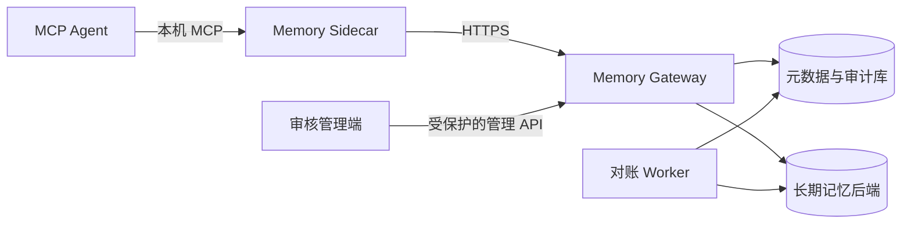

# 多 Agent 共享记忆系统设计

当前实现基线：适用于支持 MCP 或 HTTP 的 Agent，可从单机原型逐步扩展到多设备自托管部署。

这份文档只说明可复用的系统设计。域名、IP、账号、数据库地址、证书指纹、现场记录和密钥都不应写入这里。

## 从体验到正式接入

仓库提供两条入口，方便在不同阶段使用同一套能力：

- 本地体验脚本用 SQLite 和临时主体验证两个 Agent 的跨 Agent 检索，所有数据留在当前电脑。
- 正式接入通过设备绑定、Sidecar、HTTPS 和已登记工作区连接共享服务。

两条入口都遵循相同的身份、工作区、审计和检索规则。前者不承担跨设备安全与高可用职责；后者使用 PostgreSQL 元数据库、加密 outbox 和显式迁移流程。具体操作见 [快速上手](quickstart.md) 和 [部署说明](deployment.md)。

## 先说清楚：什么会进入共享库

共享库保存的是值得在以后继续使用的长期信息，例如已经确认的偏好、项目决定、设备事实和经过审核的工作区知识。每一条记录都带有来源、所属工作区、状态和审计信息。

这些内容仍留在原来的位置：Agent 的完整会话记录、项目文件、工具运行状态和模型的即时上下文。系统也不会把所有聊天内容自动沉淀为长期记忆。

客户端通过 Gateway 读写数据，不能直连数据库；部署时也不依赖某一家 Agent、某个公网服务或第三方向量 API。

## 一条记忆如何经过系统



### 每个组件各自做什么

| 组件 | 日常工作 | 使用时需要知道 |
|---|---|---|
| MCP Agent | 调用记忆工具并把结果交给当前任务 | 不保存 Gateway 凭据，也不直接连接数据库 |
| Sidecar | 管理本机认证、加密 outbox、缓存和离线同步 | 每台设备只启动一个，供本机多个 Agent 共用 |
| Gateway | 验证身份、判断权限、接收事件、提供检索与审核接口 | 不保存完整会话历史 |
| Worker | 重试、跨库对账、死信处理和后台结晶 | 不对 Agent 暴露直接接口 |
| 元数据库 | 保存绑定、事件账本、回执、审核、同步状态和审计 | 不作为原始聊天记录仓库 |
| 长期记忆后端 | 保存已确认记忆、检索索引和引用 | 不承担身份认证或公网入口 |

Sidecar 是每台设备唯一的本机状态所有者。同一设备上的多个 Agent 共享它，避免两个进程同时维护离线队列。

Sidecar 启动时必须写明默认工作区。MCP 工具没有带 `workspace_id` 时就使用这个值；它只是一项本机配置，不会替调用者绕过 Gateway 的工作区授权。

## 谁能看到哪些记忆

### 系统如何确认调用者

有效主体由以下边界共同确定：租户、用户、设备、Agent 安装实例和工作区。请求体中的字段只用于表达意图，不能单独作为授权依据。

首次接入使用一次性配对码和设备公钥完成绑定。设备以 Ed25519 证明持有私钥；Gateway 发放短期访问令牌，刷新凭据仅保存在受操作系统保护的本机位置。撤销设备或 Agent 时递增对应 epoch，使旧令牌和旧同步状态失效。

### 每次请求都会经过的判断

1. 先验证调用者身份和令牌。
2. 根据已登记的绑定关系确定可见作用域。
3. 在检索候选前执行作用域过滤。
4. 管理能力，例如审核、撤销和重建结晶记忆，单独授予。
5. 所有授权失败都应有可审计但不含正文的记录。

这意味着伪造 `user_id`、`device_id` 或 `workspace_id` 不会扩大权限。

## 一条记忆从写入到变化的过程

```text
事件提交
  -> 敏感信息与注入检查
  -> 幂等账本
  -> 已确认写入 或 审核候选
  -> 长期记忆后端
  -> 授权检索
  -> 反馈、遗忘、归档或补偿撤销
```

### 重复发送不会重复记一遍

每个写入事件都有稳定事件 ID、来源、作用域和时间。Gateway 先持久化事件及其处理状态，再生成领域效果。重复提交同一个事件时返回首次形成的固定回执，不再重复写入事实或重复计数。

跨数据库写入不假设分布式事务。元数据库先记录待处理事件，Worker 通过可重试、可对账的步骤写入长期记忆后端，并回填稳定引用。失败事件按退避策略重试，超过上限进入死信队列，供人工处理。

### 有分歧时先交给审核

普通观察默认形成候选，不立即成为共享事实。明确用户决定或已授权的自动化来源可以进入已确认路径。

系统比较作用域、语义键、时间边界和来源，发现可能冲突时要求审核。审核操作使用 revision 防止旧页面覆盖新状态；撤销不是删除历史，而是追加补偿记录。保留双方、取代、归档和拒绝都必须留下来源与理由。

### 把稳定事实整理成一页结晶记忆

结晶记忆是一页可重建的摘要，用于把多条稳定事实压缩为高价值上下文。它有自己的输入引用和版本，任一输入变更后标记为失效，只有显式重建才生成新版本。

## 找回和遗忘记忆时发生什么

检索流程固定为：授权过滤、候选召回、去重与重排、token 预算裁剪、结构化返回。返回项携带记忆 ID、来源、时间、状态和追踪信息，Agent 可以解释“为什么看到了这条记忆”。

### 先确定能看什么，再决定排在前面的内容

Gateway 先从元数据库取出当前调用者可见的事实引用，再从长期记忆后端读取这些事实。后端不会收到未经授权的引用，也不会参与权限判断。

进入候选集后，系统同时比较三类信号：普通词匹配、中文单字与相邻双字匹配，以及由这些特征生成的本地哈希向量。词匹配占 50%，特征向量相似度占 35%，记忆本身的可信度占 15%。这一版不调用外部向量服务，也不会把正文发送到第三方。

内容相同或特征相似度过高的记录只保留一条。随后按 MMR 重排：与已选内容过于接近的记录会降分，不同作用域或类型的记录得到小幅优先。这样不会连续塞入几条意思相同的记忆。

### 上下文预算怎么算

`memory_context` 的 `max_tokens` 取值为 64 到 12,000，默认 1,200。它限制的是被选中记忆的保守估算量：中文按字计，英文连续字母数字按约三个字符计，每条引用另计固定开销。选中内容的估算总和不会超过调用方给出的值；放不下的候选会被跳过，并在返回结果中标为 `incomplete`。

固定的安全说明和返回字段不计入这个记忆预算。这样 Agent 总能收到“记忆只是引用数据”的约束，调用方也能从 `token_estimate`、`token_budget` 和 `retrieval` 看到实际选了多少内容、去掉了多少重复项。

遗忘不是简单按时间删除。系统综合使用频率、最近访问、反馈、来源可信度、明确失效标记和保留策略评分。删除或归档会产生墓碑和同步 epoch，离线旧设备不能把已遗忘的内容重新上传。

## 设备暂时离线时怎么处理

Sidecar 将待发送内容保存在加密 outbox 中。网络可用时按批次 push，并通过不透明游标 pull 远端变化；网络不可用时只接受本地加密写入。恢复后按设备序号、事件 ID、同步 epoch 和终态回执对齐状态。

离线查询从已授权的加密缓存和待发送事件中取候选，使用同一套中文匹配、去重、重排和预算规则。返回结果会明确带上 `offline` 和 `incomplete`，避免 Agent 把本机缓存当成完整的远端视图。

离线同步始终遵循四条规则：

- 本地队列不保存明文敏感记忆。
- 不因临时断网改走未受保护的公网地址。
- 清理已同步密文必须得到用户明确确认。
- 两个 Sidecar 进程不能同时拥有同一个 outbox。

## 敏感信息和可疑指令如何处理

写入和返回都要经过安全闸门：

- 在持久化前识别密码、令牌、私钥、连接串和其他高风险内容；拒绝时仅保留不可逆指纹用于诊断。
- 将记忆正文与系统指令严格隔离；命令式或可疑内容以数据形式返回，不能提升为执行指令。
- 日志、审计和错误信息只记录必要元数据，不记录密钥、正文或可复原的凭据。
- 密钥按用途分开：事件加密、令牌签名、刷新重放保护、outbox 加密和拒绝指纹不得复用。

## 数据库升级与故障恢复

SQLite 适合本地演示。生产部署采用 PostgreSQL 元数据库，并可连接独立的长期记忆后端。运行账号只拥有业务所需的最小权限；迁移账号只用于显式 schema 变更；Gateway 启动时不自动改数据库结构。

迁移按固定顺序进行：

1. `check`：只读检查版本、扩展、表、索引和权限。
2. `apply`：在备份和人工确认后执行新增迁移。
3. `verify`：确认 schema 版本、权限和运行时检查均通过。

已经登记的迁移文件不能改写，只能新增。恢复时先恢复元数据库与长期记忆后端，再通过事件账本、回执和后端引用执行对账。

## 部署时把服务放在什么位置

容器化部署至少包含 Gateway、Worker 和 HTTPS 反向代理。数据库只在内部网络可达；对外仅开放受保护的 Gateway 或管理入口。局域网客户端直接连接内部 HTTPS 地址，外网客户端通过 VPN、零信任网络或受控隧道进入同一安全边界。

部署文件、示例配置和文档只能包含变量名与占位符。环境文件、证书、私钥、主体配置、数据库快照、现场日志和发布记录必须留在本地受保护位置，并由 `.gitignore` 排除。

## 上线前应该逐项看到的结果

- 多个已授权 Agent 能读写相同作用域的记忆。
- 未授权主体不能通过伪造字段读取其他设备或工作区的内容。
- 同一事件重复重放只产生一次领域效果和同一终态回执。
- 断网写入在恢复后不丢失、不重复，且不会以明文落盘。
- 冲突进入审核；审核、撤销、遗忘和结晶重建均可追溯。
- 密钥、令牌、连接串和私钥不会出现在 Git、日志、MCP 配置或长期记忆中。
- 升级和故障恢复可通过迁移检查、健康检查与对账任务验证。

具体命令和发布检查表见 [部署说明](deployment.md)。
