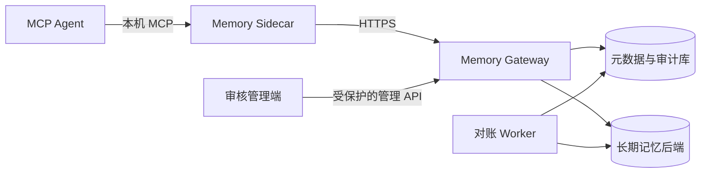

# 多 Agent 共享记忆系统设计

状态：实施基线
适用范围：任意支持 MCP 或 HTTP 的 Agent、单机或多设备自托管部署

本文说明 Agent Memory Gateway 的通用设计。它不包含任何具体主机名、IP、账号、数据库地址、证书指纹、现场操作记录或密钥。

## 1. 目标与边界

### 1.1 目标

- 让多个 Agent 在授权范围内共享长期记忆，而不是共享完整会话历史。
- 将身份、权限、记忆来源、冲突、遗忘和审计作为存储层的一部分，而不是交给提示词约定。
- 设备离线时仍可安全写入，恢复网络后不丢失、不重复、不越权。
- 支持从本地原型逐步迁移到独立 Gateway、数据库和外部记忆后端。

### 1.2 非目标

- 不替代 Agent 自己的会话记录、项目文件、工具状态或模型上下文。
- 不自动把所有聊天内容变成长期记忆。
- 不让客户端直接访问数据库，也不把数据库当作公开 API。
- 不默认依赖公网、第三方向量 API 或特定厂商的 Agent。

## 2. 架构



### 2.1 组件职责

| 组件 | 负责什么 | 不负责什么 |
|---|---|---|
| MCP Agent | 调用记忆工具、展示结果 | 直接保存凭据、直连数据库 |
| Sidecar | 本机认证、加密 outbox、缓存、离线同步 | 决定跨用户权限、写数据库 schema |
| Gateway | 身份验证、授权、事件接收、检索、审核 API | 保存 Agent 的会话历史 |
| Worker | 重试、跨库对账、死信、后台结晶 | 对外提供 Agent 接口 |
| 元数据库 | 绑定、事件账本、回执、审核、同步状态、审计 | 作为原始聊天记录仓库 |
| 长期记忆后端 | 已确认记忆、检索索引和引用 | 身份认证与外部网络入口 |

Sidecar 是每台设备唯一的本机状态所有者。同一设备上的多个 Agent 共享它，避免两个进程同时维护离线队列。

## 3. 身份与权限

### 3.1 身份模型

有效主体由以下边界共同确定：租户、用户、设备、Agent 安装实例和工作区。请求体中的字段只用于表达意图，不能单独作为授权依据。

首次接入使用一次性配对码和设备公钥完成绑定。设备以 Ed25519 证明持有私钥；Gateway 发放短期访问令牌，刷新凭据仅保存在受操作系统保护的本机位置。撤销设备或 Agent 时递增对应 epoch，使旧令牌和旧同步状态失效。

### 3.2 授权规则

1. 先验证调用者身份和令牌。
2. 根据已登记的绑定关系确定可见作用域。
3. 在检索候选前执行作用域过滤。
4. 管理能力，例如审核、撤销和重建结晶记忆，单独授予。
5. 所有授权失败都应有可审计但不含正文的记录。

这意味着伪造 `user_id`、`device_id` 或 `workspace_id` 不会扩大权限。

## 4. 记忆生命周期

```text
事件提交
  -> 敏感信息与注入检查
  -> 幂等账本
  -> 已确认写入 或 审核候选
  -> 长期记忆后端
  -> 授权检索
  -> 反馈、遗忘、归档或补偿撤销
```

### 4.1 事件与幂等

每个写入事件都有稳定事件 ID、来源、作用域和时间。Gateway 先持久化事件及其处理状态，再生成领域效果。重复提交同一个事件时返回首次形成的固定回执，不再重复写入事实或重复计数。

跨数据库写入不假设分布式事务。元数据库先记录待处理事件，Worker 通过可重试、可对账的步骤写入长期记忆后端，并回填稳定引用。失败事件按退避策略重试，超过上限进入死信队列，供人工处理。

### 4.2 候选、冲突与审核

普通观察默认形成候选，不立即成为共享事实。明确用户决定或已授权的自动化来源可以进入已确认路径。

系统比较作用域、语义键、时间边界和来源，发现可能冲突时要求审核。审核操作使用 revision 防止旧页面覆盖新状态；撤销不是删除历史，而是追加补偿记录。保留双方、取代、归档和拒绝都必须留下来源与理由。

### 4.3 结晶记忆

结晶记忆是一页可重建的摘要，用于把多条稳定事实压缩为高价值上下文。它有自己的输入引用和版本，任一输入变更后标记为失效，只有显式重建才生成新版本。

## 5. 检索与遗忘

检索流程固定为：授权过滤、候选召回、去重与重排、token 预算裁剪、结构化返回。返回项携带记忆 ID、来源、时间、状态和追踪信息，Agent 可以解释“为什么看到了这条记忆”。

遗忘不是简单按时间删除。系统综合使用频率、最近访问、反馈、来源可信度、明确失效标记和保留策略评分。删除或归档会产生墓碑和同步 epoch，离线旧设备不能把已遗忘的内容重新上传。

## 6. 在线与离线同步

Sidecar 将待发送内容保存在加密 outbox 中。网络可用时按批次 push，并通过不透明游标 pull 远端变化；网络不可用时只接受本地加密写入。恢复后按设备序号、事件 ID、同步 epoch 和终态回执对齐状态。

同步设计遵循四条规则：

- 本地队列不保存明文敏感记忆。
- 不因临时断网改走未受保护的公网地址。
- 清理已同步密文必须得到用户明确确认。
- 两个 Sidecar 进程不能同时拥有同一个 outbox。

## 7. 敏感信息与提示注入防护

写入和返回都要经过安全闸门：

- 在持久化前识别密码、令牌、私钥、连接串和其他高风险内容；拒绝时仅保留不可逆指纹用于诊断。
- 将记忆正文与系统指令严格隔离；命令式或可疑内容以数据形式返回，不能提升为执行指令。
- 日志、审计和错误信息只记录必要元数据，不记录密钥、正文或可复原的凭据。
- 密钥按用途分开：事件加密、令牌签名、刷新重放保护、outbox 加密和拒绝指纹不得复用。

## 8. 存储、迁移与恢复

SQLite 适合本地演示。生产部署采用 PostgreSQL 元数据库，并可连接独立的长期记忆后端。运行账号只拥有业务所需的最小权限；迁移账号只用于显式 schema 变更；Gateway 启动时不自动改数据库结构。

迁移固定为三步：

1. `check`：只读检查版本、扩展、表、索引和权限。
2. `apply`：在备份和人工确认后执行新增迁移。
3. `verify`：确认 schema 版本、权限和运行时检查均通过。

已经登记的迁移文件不能改写，只能新增。恢复时先恢复元数据库与长期记忆后端，再通过事件账本、回执和后端引用执行对账。

## 9. 部署边界

容器化部署至少包含 Gateway、Worker 和 HTTPS 反向代理。数据库只在内部网络可达；对外仅开放受保护的 Gateway 或管理入口。局域网客户端直接连接内部 HTTPS 地址，外网客户端通过 VPN、零信任网络或受控隧道进入同一安全边界。

部署文件、示例配置和文档只能包含变量名与占位符。环境文件、证书、私钥、主体配置、数据库快照、现场日志和发布记录必须留在本地受保护位置，并由 `.gitignore` 排除。

## 10. 验收标准

- 多个已授权 Agent 能读写相同作用域的记忆。
- 未授权主体不能通过伪造字段读取其他设备或工作区的内容。
- 同一事件重复重放只产生一次领域效果和同一终态回执。
- 断网写入在恢复后不丢失、不重复，且不会以明文落盘。
- 冲突进入审核；审核、撤销、遗忘和结晶重建均可追溯。
- 密钥、令牌、连接串和私钥不会出现在 Git、日志、MCP 配置或长期记忆中。
- 升级和故障恢复可通过迁移检查、健康检查与对账任务验证。

具体命令和发布检查表见 [部署说明](deployment.md)。
