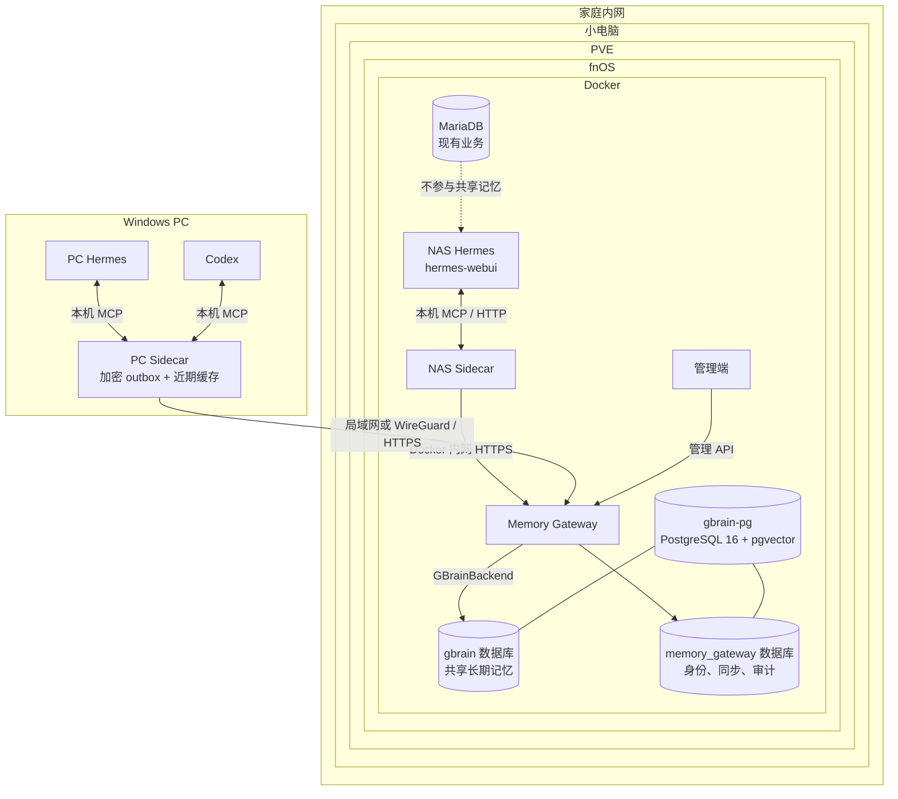
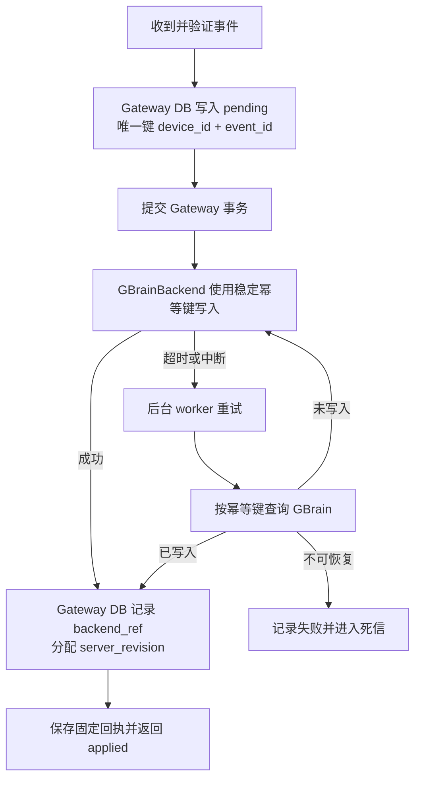
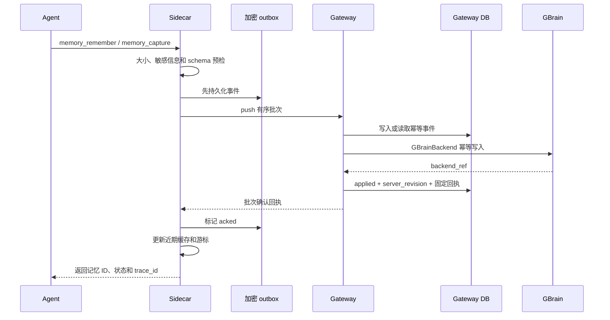
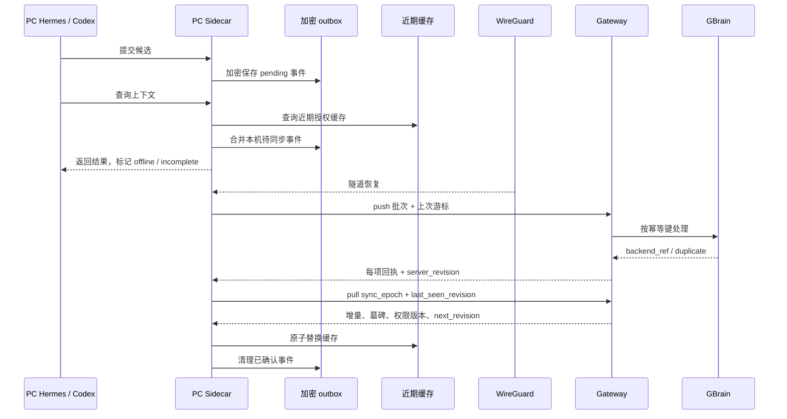
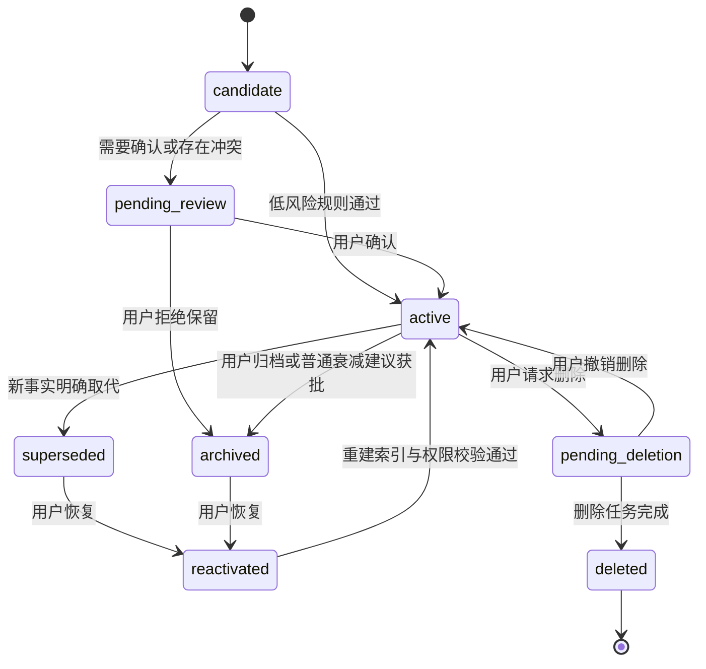
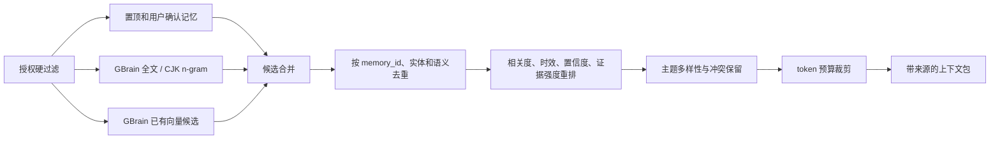
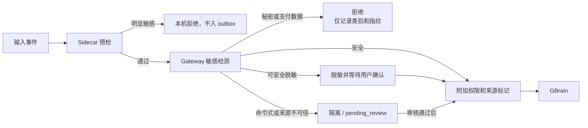

# 多 Agent 共享记忆系统主设计（v2）

日期：2026-07-10
状态：实施基线
适用环境：fnOS Docker、Windows PC、Hermes、Codex、GBrain PostgreSQL

`docs/design-v2.md` 是本项目唯一的主设计文档。README 只保留安装、配置和使用入口，详细原理以本文为准。

## 1. 目标与实际环境

### 1.1 当前设备

家庭侧是一台运行 PVE 的小电脑。PVE 中安装 fnOS，fnOS 的 Docker 里已经运行：

- NAS Hermes，对应现有 `hermes-webui` 容器和数据卷。
- MariaDB，供现有业务使用，不参与共享记忆。
- GBrain PostgreSQL，镜像为 `pgvector/pgvector:pg16`，`gbrain` 数据库中已有长期记忆和向量数据。

Windows PC 上运行 PC Hermes 和 Codex。PC 在家中可通过局域网访问 fnOS，离家后通过 WireGuard 路由回家庭内网。

本设计新增三个服务：

- Memory Gateway：共享记忆唯一服务入口。
- NAS Sidecar：服务 NAS Hermes。
- 管理端：设备配对、候选审核、搜索、审计和故障处理。

Windows PC 上运行一个共用的 PC Sidecar，PC Hermes 和 Codex 都通过它访问共享记忆。PC Sidecar 默认由 Agent 需要时拉起，可选安装为 Windows 自启动服务。

### 1.2 实际部署架构



### 1.3 系统目标

- NAS Hermes、PC Hermes 和 Codex 共享同一套经过授权的长期记忆。
- GBrain 保存全部已确认的共享长期记忆，不另建第二套长期记忆库。
- Agent 只连接本机 Sidecar，不直接连接 Gateway 或 PostgreSQL。
- PC 离线时可以继续写入和查询近期数据；WireGuard 恢复后自动补同步。
- 跨设备重试不会重复产生事实、计数、来源或状态变更。
- 任何召回都先做权限过滤，越权记录不会进入候选集。
- 用户能查看来源、确认候选、处理冲突、撤销设备和删除记忆。
- 敏感内容在持久化之前被拒绝或脱敏，记忆内容不能变成模型指令。

### 1.4 非目标

- 不替代 Hermes、Codex 的会话历史、配置、工具状态和运行时。
- 不把所有对话自动保存为长期记忆。Agent 只能提交事件或候选，长期状态由规则和用户确认决定。
- 不要求公网暴露 fnOS，不允许客户端直连 GBrain PostgreSQL。
- 第一阶段不做团队空间、公开分享、复杂知识图谱和跨用户协作。
- 默认不依赖外部 embedding API。没有 API key 时，全文和中文 n-gram 检索必须可用。
- 不把 MariaDB 改造成共享记忆存储，也不迁移它的现有业务数据。

### 1.5 成功标准

1. NAS Hermes、PC Hermes、Codex 能通过各自 Sidecar 写入和读取同一用户的授权记忆。
2. 断开 WireGuard 后，PC 的写入进入加密 outbox；恢复后不丢失、不重复。
3. 伪造请求体中的用户、设备、Agent 或工作区身份不能扩大权限。
4. 相同 `event_id` 重放多次，只得到第一次的领域效果和确认结果。
5. 用户确认的新决定可以取代旧决定，无法判断的冲突进入审核。
6. 密码、token、私钥等内容不会出现在 GBrain、Gateway 事件明文或审计日志中。
7. 删除后的记忆不会被离线旧设备重新上传。
8. GBrain、Gateway 或 WireGuard 故障后可以恢复，并能解释同步停在哪一步。
9. 每个上下文包都有记忆 ID、来源、时间、状态和 trace ID。

这些要求的优先级不是平均分配。身份、授权、严格作用域、敏感信息、注入安全和幂等属于 P0；同步、并发和故障恢复属于 P1；冲突审核和检索质量在前两层稳定后完善。

## 2. 数据归属与组件职责

### 2.1 数据边界

```mermaid
flowchart LR
  subgraph AgentLocal["Agent 本机数据"]
    A1["Hermes / Codex 会话"]
    A2["配置、工具状态、私有运行数据"]
  end

  subgraph SidecarLocal["Sidecar 本机数据"]
    S1["加密 outbox"]
    S2["近期授权缓存"]
    S3["同步游标与权限版本"]
    S4["设备凭据"]
  end

  subgraph GatewayMeta["Gateway 元数据"]
    M1["用户、设备、Agent 安装实例"]
    M2["授权、配对、令牌撤销"]
    M3["事件状态、幂等回执、revision"]
    M4["审核、审计、失败与死信索引"]
  end

  subgraph GBrain["GBrain 长期记忆"]
    G1["已确认原子事实"]
    G2["结晶总结与主张"]
    G3["来源、时间线、关系"]
    G4["全文与向量索引"]
  end

  AgentLocal -->|"候选事件"| SidecarLocal
  SidecarLocal -->|"push / pull"| GatewayMeta
  GatewayMeta -->|"MemoryBackend"| GBrain
  GBrain -->|"已授权增量与上下文"| GatewayMeta
  GatewayMeta --> SidecarLocal
  SidecarLocal -->|"引用数据"| AgentLocal
```



| 数据 | 存放位置 | 说明 |
|---|---|---|
| Hermes/Codex 会话、配置和私有状态 | 各自本机 | 不上传，不由本系统接管 |
| 待同步事件 | Sidecar 加密 outbox | 传输完成前保留；只存最小必要字段 |
| 近期查询缓存 | Sidecar | 按用户、工作区、权限版本和过期时间分区 |
| 设备凭据 | Windows Credential Manager 或容器 secret | 不写普通配置文件，不进入日志 |
| 身份、授权、同步和审计 | `memory_gateway` 数据库 | 与 `gbrain` 分库、分账号 |
| 待审核候选 | Gateway 元数据数据库 | 加密保存，设保留期；确认后写入 GBrain |
| 已确认共享长期记忆 | `gbrain` 数据库 | 系统唯一事实源 |
| 向量和全文索引 | GBrain | 是检索索引，可重建，不单独成为事实源 |

Gateway 不保存另一份完整长期记忆正文。它只保留事件状态、权限绑定、幂等键、审核所需的临时候选和 GBrain `backend_ref`。候选被拒绝或过期后，正文按保留策略清理，只留下不含明文的审计结果。

### 2.2 组件职责

| 组件 | 负责 | 不负责 |
|---|---|---|
| Agent | 提交记忆候选、查询上下文、反馈对错 | 决定权限、直接激活长期事实、处理跨设备冲突 |
| Sidecar | 本机 MCP、预检、加密排队、缓存、push/pull | 长期事实裁决、跨域读取、直接访问数据库 |
| Gateway | 认证、授权、事件幂等、审核、冲突、检索、审计 | 保存 Agent 会话、信任请求体身份、执行记忆中的命令 |
| GBrainBackend | 把统一领域操作映射到 GBrain | 决定用户权限、设备身份和管理策略 |
| GBrain | 保存已确认记忆、来源、关系、索引 | 处理设备配对、Sidecar 队列和 UI 登录 |
| 管理端 | 展示和调用管理 API | 直连 PostgreSQL 或绕过 Gateway |
| Worker | 对账、结晶、索引、清理、重试 | 绕过事件状态直接改写权限或事实 |

### 2.3 GBrain 表映射

现有 `gbrain` 数据库继续使用，不重建数据卷。GBrainBackend 根据实际 schema 版本做适配，不能假设所有字段永远不变。

| GBrain 表 | 在本系统中的用途 |
|---|---|
| `facts` | 原子事实、置信度、有效期、取代关系和合并结果 |
| `pages` | 多条稳定事实结晶出的总结；保留组成来源 |
| `takes` | 主张、候选立场、状态和冲突解决结果 |
| `sources` | 设备、Agent、工作区、文件、导入批次等来源 |
| `content_chunks` | 全文、中文 n-gram 和向量检索候选 |
| `timeline_entries` | 决定、变更、确认、撤销等时间线 |
| `links` | 记忆之间的支持、取代、冲突、组成和引用关系 |

`raw_data` 可以用于受控导入暂存，但不直接进入召回。GBrain 中已有的 `pg_trgm`、`pgcrypto` 和 `vector` 能力继续保留。适配器启动时要检查扩展、表和必要字段；不兼容时进入只读降级并报告 schema 版本，不得边运行边猜测写入。

### 2.4 MemoryBackend

Gateway 只依赖通用后端接口，当前生产实现是 `GBrainBackend`：

```text
MemoryBackend
  health()
  schema_version()
  upsert_confirmed(idempotency_key, memory, sources) -> backend_ref
  get_by_refs(visibility_filter, refs)
  search(visibility_filter, query, retrieval_policy) -> candidates
  supersede(idempotency_key, old_ref, new_ref)
  archive(idempotency_key, ref)
  reactivate(idempotency_key, ref)
  tombstone(idempotency_key, ref, deleted_revision)
  rebuild_crystal(source_refs)
```

接口有四条硬约束：

1. 所有写操作必须接收稳定幂等键。
2. `search` 必须接收非空的 `visibility_filter`，不能提供“先查全部、再由 Gateway 过滤”的实现。
3. 返回结果必须包含稳定 `backend_ref` 和来源引用。
4. 适配器错误分为可重试、不可重试和 schema 不兼容，不能统一返回 500。

GBrainBackend 优先使用 GBrain 已有外部 ID 或唯一约束实现幂等；如果现有 schema 不支持，则在 `gbrain` 数据库中增加最小的 adapter binding 表。该表只保存幂等键与 GBrain 引用，不复制记忆正文。

其他开源后端可以实现同一接口，但不得绕过 Gateway 的身份、授权、审核和审计规则。

## 3. 身份、授权与严格作用域

### 3.1 身份模型

| 身份 | 含义 | 示例 |
|---|---|---|
| `user_id` | 记忆拥有者 | 当前个人管理员 |
| `device_id` | 已配对设备 | NAS、Windows PC |
| `agent_installation_id` | 某台设备上的 Agent 安装实例 | NAS Hermes、PC Hermes、PC Codex |
| `workspace_id` | 稳定工作区标识 | 某个 GitHub 项目或个人工作区 |
| `session_id` | 一次 Agent 会话 | 短期上下文范围 |
| `principal_id` | 用户、设备或 Agent 的统一权限主体 | private 作用域所有者 |
| `tenant_id` | 内部隔离边界 | 当前固定为个人实例，后续团队化时启用 |

`workspace_id` 是 Gateway 签发或登记的稳定 ID，本机路径只是 Sidecar 保存的别名。`D:\Program\...` 和 NAS 容器路径不能直接充当跨设备权限键。

PC Hermes 和 Codex 共用 PC Sidecar，但使用不同的 `agent_installation_id`。Sidecar 为当前 Agent 请求短期访问令牌，Agent 身份写入令牌声明；后续请求从令牌解析，不能只靠 JSON 中的 `agent_id`。

### 3.2 配对和凭据

默认配对过程：

1. 管理员在管理端或 Gateway CLI 生成一次性配对码，默认 10 分钟失效且只能使用一次。
2. Sidecar 提交配对码、设备公钥、设备名称和本机生成的 nonce。
3. Gateway 要求管理员确认设备类型和允许的 Agent 安装实例。
4. Gateway 签发设备刷新凭据。Windows 存入 Credential Manager；NAS Sidecar 使用只读挂载的 secret 文件。
5. Sidecar 用刷新凭据换取短期访问令牌，默认有效期 15 分钟。
6. 刷新凭据每次使用后轮换；旧值只保留短暂重放窗口。
7. 管理端可以撤销整台设备、单个 Agent 安装实例或全部会话。

设备私钥不可导出到普通日志或配置。MCP 子进程只接触短期令牌，不持有长期刷新凭据。设备丢失后，管理员撤销凭据并提升 `auth_epoch`；旧 token、缓存和未签名 outbox 都失效。

### 3.3 身份信任边界

Gateway 只相信：

- 经过验证的设备或访问令牌声明。
- 由已配对设备密钥签名的离线事件信封。
- Gateway 自己保存的设备、Agent、工作区绑定关系。

请求体中的 `user_id`、`device_id`、`agent_installation_id`、`tenant_id` 和权限字段不参与身份判定。出现这些字段时：

- 与凭据一致：忽略请求体值，仍使用凭据主体。
- 与凭据不一致：拒绝请求并记录 `IDENTITY_MISMATCH`。
- 请求工作区不在令牌允许列表：拒绝为 `WORKSPACE_FORBIDDEN`。
- 请求 scope 超过当前能力：拒绝为 `SCOPE_ESCALATION`。

审计记录主体 ID、字段名和 trace ID，不保存攻击请求中的敏感正文。

### 3.4 作用域读取规则

| 作用域 | 默认读取条件 | 写入限制 |
|---|---|---|
| `user` | 同一 `tenant_id + user_id` | 只能为凭据中的用户写入 |
| `workspace` | 同一用户，且 `workspace_id` 在允许列表 | 工作区必须已登记并绑定当前主体 |
| `device` | 同一用户、同一 `device_id` | 设备 ID 固定取自凭据 |
| `agent` | 同一用户、同一 `agent_installation_id` | Agent ID 固定取自访问令牌 |
| `session` | 同一会话，且未过期 | 到期后不进入长期召回 |
| `private` | `owner_principal_id` 与当前主体完全一致 | 不能被自动改成 shared |
| `shared` | 同一租户且属于明确的 `share_group_id` | 当前个人版默认关闭，必须由管理员开启 |

规则取交集，不取并集。例如一条 `workspace + private(agent)` 记忆必须同时满足工作区和 Agent 主体。任何状态转换都不能自动扩大可见范围。`pinned`、高置信度和高相关度也不能绕过权限。

当前部署只有一个用户，但仍保留用户隔离字段和测试。这样以后增加账号时，不需要重写数据模型。

### 3.5 授权与召回


授权过滤必须出现在 GBrain 候选查询之前。实现上有两种允许方式：

- 根据已授权的 GBrain `source_id` 生成过滤条件。
- 根据 Gateway 的权限绑定生成允许的 `backend_ref` 集合，并在 GBrain SQL 中使用 `WHERE id = ANY(...)` 或临时表连接。

禁止先做全库向量检索再在应用层删除越权结果。`MemoryBackend.search` 收到空过滤条件时必须返回空集，不能把空条件解释为“不限制”。

设备令牌按能力拆分：

| capability | 用途 |
|---|---|
| `memory.read_context` | 获取上下文包 |
| `memory.search` | 搜索有权查看的记忆 |
| `memory.write_event` | 追加候选事件 |
| `memory.feedback` | 确认、纠错或标记过期 |
| `memory.forget` | 请求归档或删除 |
| `memory.sync` | push/pull |
| `memory.manage` | 审核、冲突处理、设备管理；普通 Agent 不持有 |

## 4. 事件、幂等、事务与并发

### 4.1 不可变事件

Agent 提交事件，不直接修改 GBrain 表。事件信封不接受自报身份：

```json
{
  "event_id": "01J...",
  "device_seq": 184,
  "event_type": "memory.proposed",
  "occurred_at": "2026-07-10T08:30:00Z",
  "workspace_id": "ws_project_a",
  "session_id": "sess_...",
  "payload": {
    "content": "这个项目的共享记忆通过本机 Sidecar 接入。",
    "kind": "decision",
    "requested_scope": "workspace",
    "evidence": "user_explicit",
    "confidence": 1.0
  },
  "causation_id": "01J...",
  "schema_version": 1,
  "signature": "device-signature"
}
```

Gateway 从凭据补入 `tenant_id`、`user_id`、`device_id` 和 `agent_installation_id`。字段含义：

- `event_id`：客户端生成的 UUIDv7 或 ULID，设备内永久不复用。
- `device_seq`：设备单调递增序号，用于发现缺口，不作为全局顺序。
- `server_revision`：Gateway 在领域效果确认后分配的单调版本。
- `causation_id`：把提议、反馈、取代和删除串成因果链。
- `schema_version`：用于兼容旧 Sidecar。
- `signature`：离线事件的设备签名，覆盖事件正文和序号。

唯一约束是 `(device_id, event_id)`。同一键再次提交：

- 正文哈希一致：返回原确认结果。
- 正文哈希不同：拒绝为 `EVENT_ID_REUSE`。
- 不得重复增加来源、访问计数、置信度或 revision。

### 4.2 确认回执

```json
{
  "event_id": "01J...",
  "status": "applied",
  "result": "candidate_created",
  "server_revision": 9281,
  "backend_ref": "gbrain:fact:...",
  "ack_id": "ack_...",
  "processed_at": "2026-07-10T08:30:02Z",
  "trace_id": "tr_..."
}
```

`status` 只有以下值：

- `pending`：Gateway 已持久化，GBrain 尚未确认。
- `applied`：领域效果完成，可从 outbox 移除。
- `duplicate`：已经处理，返回首次 `ack_id` 和相同结果。
- `rejected`：不可重试错误，附稳定错误码。
- `retryable_failed`：临时失败，保留在 outbox。

Sidecar 只有收到 `applied`、`duplicate` 或不可重试的 `rejected` 才结束该事件。HTTP 200 但单项状态为 `pending` 时仍要继续查询或重试。

### 4.3 跨数据库写入与对账

`memory_gateway` 和 `gbrain` 是同一 PostgreSQL 容器中的两个数据库，PostgreSQL 不能用普通事务跨库原子提交。本系统采用可恢复的事件流程，不使用分布式两阶段提交，也不采用“最后写入覆盖一切”。



崩溃点和恢复方式：

| 崩溃点 | 恢复 |
|---|---|
| Gateway pending 尚未提交 | 客户端重试，按唯一键重新创建 |
| pending 已提交，GBrain 未写 | worker 重试 |
| GBrain 已写，Gateway 未记录 | worker 用幂等键查到 backend_ref 后补记 |
| Gateway 已记录，回执未到客户端 | 客户端重试，返回原回执 |
| 回执已到，Sidecar 未更新 outbox | Sidecar 重试，得到 duplicate 原回执 |

### 4.4 事务边界

- 每个 HTTP 请求有独立的数据库会话和明确提交点。
- 身份校验、事件唯一约束和状态转换在 Gateway 数据库事务内完成。
- GBrain 写入由 GBrainBackend 的独立事务完成。
- 审核状态更新使用 `UPDATE ... WHERE revision = expected_revision`。
- 更新行数为 0 时返回 `REVISION_CONFLICT`，客户端重新读取后再决定。
- 审计记录与对应 Gateway 状态变更同事务写入。
- 后台任务通过 `FOR UPDATE SKIP LOCKED` 领取，避免多个 worker 重复处理。
- 数据库迁移使用 advisory lock，一次只允许一个实例执行。

### 4.5 连接与并发

Gateway 分别为 `memory_gateway` 和 `gbrain` 建立有上限的连接池，不共享全局裸连接。池大小根据 NAS 内存和 PostgreSQL `max_connections` 配置，部署前要计算 Gateway、worker、GBrain 原服务和维护连接的总量。

Sidecar 本地存储遵循：

- 一个 Sidecar 进程服务本机全部 Agent，outbox 只有一个写者。
- SQLite 开启 WAL、`busy_timeout` 和完整事务；敏感字段使用 AEAD 或 SQLCipher 加密。
- 进程锁阻止两个 PC Sidecar 同时打开同一 outbox。
- MCP 调用可并发，但入队、游标推进和缓存替换串行提交。
- 关闭进程前刷盘，不以进程内队列代替持久化。

并发测试至少覆盖：

- 100 个相同事件同时重放，只产生一次效果。
- 两个设备同时更新同一事实，进入明确的冲突或取代状态。
- 审核员同时处理同一候选，只有一个 revision 更新成功。
- pull 与删除同时发生，客户端最终收到墓碑。
- worker 崩溃并重启，不丢失 pending 任务。
- 连接池耗尽时快速失败和退避，不无限挂起请求。

## 5. 在线与离线同步

### 5.1 在线写入



即使在线，Sidecar 也要先写 outbox 再发送。这样 Agent 进程、Sidecar 或网络在任意时刻退出，事件仍可恢复。

### 5.2 PC 离线



离线查询的返回值必须包含：

```json
{
  "offline": true,
  "incomplete": true,
  "cache_as_of": "2026-07-10T08:00:00Z",
  "pending_local_events": 3,
  "last_seen_revision": 9270
}
```

Agent 和用户能看到结果可能不完整，不能把缓存时间伪装成最新状态。

### 5.3 push

`POST /v1/sync/push` 接收：

- `batch_id`、`device_id` 的凭据绑定。
- 按 `device_seq` 排序的事件数组。
- 当前 `sync_epoch`、Sidecar 已知 revision 和协议版本。
- 每批条数和总字节上限。

Gateway 返回每个事件的独立状态，不因一条失败回滚整批已经确认的其他事件。若发现序号缺口，回执包含 `missing_device_seq`，但不会错误地把后续事件当成重复。

批次整体重试时，每项仍按 `(device_id, event_id)` 幂等。`batch_id` 只用于追踪，不能代替事件幂等键。

### 5.4 pull

`POST /v1/sync/pull` 接收：

- `sync_epoch`。
- `last_seen_revision`。
- 当前 Agent、工作区和缓存范围。
- `limit` 和续页 token。

返回：

- 新增或更新的已授权记忆摘要。
- `superseded`、`archived`、`pending_deletion` 状态变化。
- 删除墓碑。
- `policy_version` 和 `auth_epoch`。
- `next_revision`、`has_more` 和 trace ID。

Sidecar 只有在一页数据和本地缓存事务都提交后才推进游标。权限版本变化时，旧缓存先失效再重新 pull，不能增量保留已经失权的数据。

### 5.5 重试和死信

Sidecar outbox 的固定状态为 `pending`、`in_flight`、`acked`、`retryable_failed` 和 `dead_letter`。状态变化与事件正文在同一个本地事务中提交，进程崩溃后可从最后状态继续。

默认退避：

```text
delay = min(base * 2^attempt, max_delay) + random_jitter
```

建议 `base=2s`、`max_delay=15min`，具体值可配置。服务端 `Retry-After` 优先。网络错误、502/503、连接池暂满属于可重试；schema 错误、身份拒绝、内容过大、敏感内容拒绝属于不可重试。

死信记录包含事件 ID、错误码、首次和最后失败时间、尝试次数、trace ID，不显示敏感正文。管理端支持：

- 查看失败原因。
- 修正可编辑字段后生成新事件，保留原因果链。
- 明确丢弃本地候选。
- 在权限恢复后重新入队。
- 导出不含正文的诊断信息。

### 5.6 墓碑和缓存

删除墓碑至少保存 `memory_id`、`deleted_revision`、`deleted_at`、`scope_binding_hash` 和 `sync_epoch`。墓碑保留时间必须长于最长离线设备保留期；无法保证时，旧设备重连要执行一次全量对账。

近期缓存只保存最近使用且仍有权限的数据，默认按容量和 TTL 双重淘汰。置顶记忆可以延长缓存时间，但权限撤销、`auth_epoch` 变化或设备撤销会立即清空对应分区。

## 6. 写入、候选、冲突和记忆结晶

### 6.1 记忆状态



`pinned` 是状态属性，不是独立生命周期。置顶只能由用户或持有 `memory.manage` 的管理端设置。

### 6.2 候选生成

Agent 通过两类入口提交：

- `memory_remember`：用户或 Agent 明确提出要记住的内容。
- `memory_capture`：从任务结果中提交结构化事件和证据，例如配置验证成功、用户明确改口或工具返回事实。

系统不声称拦截所有聊天，也不默认上传完整对话。Sidecar 只传递候选正文、必要上下文、来源和证据摘要。

默认可自动激活的内容范围很窄：用户明确表达且不敏感、作用域明确、没有冲突的低风险事实。Agent 推断的偏好、跨工作区规则、长期行为指令和安全相关内容进入 `pending_review`。

可选提取器可以接 Ollama 或 OpenAI 兼容接口，但提取结果仍是候选。没有模型时，规则提取和显式 MCP 调用保持可用。

### 6.3 冲突判定

按以下顺序处理：

1. 先比较所有者和权限边界。不同用户的记忆绝不互相冲突。
2. 比较 `entity_key + attribute_key`，再看工作区、设备、Agent 和会话命名空间。
3. 判断是否是时间变化，例如“当前端口”与“历史端口”，而不是互相覆盖。
4. 比较证据等级：`user_confirmed > tool_verified > agent_inferred > imported`。
5. 检查置顶、用户确认和有效期。
6. 能确定取代时建立 `supersedes` 关系；无法确定时双方保留并进入审核。

不同设备的路径、端口、用户名、代理地址和环境变量默认属于不同命名空间。例如 NAS 的容器路径不能自动推翻 Windows 路径。只有用户明确说明“两者代表同一配置”时才合并。

“更新”不等于“更可信”。较新的 Agent 推断不能自动推翻较旧的用户确认记忆，普通衰减也不能让置顶事实失效。

### 6.4 审核与撤销

管理端审核页显示：

- 候选正文及脱敏结果。
- 来源设备、Agent、工作区和时间。
- 冲突双方和差异字段。
- 自动判断使用的规则。
- 建议动作及实际影响范围。

审核动作包括确认、修改后确认、保留双方、取代旧记忆、归档候选和拒绝。每个动作携带 `expected_revision`，重复提交返回原结果。

用户可以撤销错误审核。撤销不会删除历史，而是创建补偿事件，恢复旧状态并更新关系。

### 6.5 结晶记忆

稳定原子事实可以结晶到 GBrain `pages`。结晶规则：

- 只读取同一授权范围内的 `active` 事实。
- 输出保存全部来源 ID、生成规则版本和生成时间。
- 不把低信任导入内容与用户确认事实混成无来源总结。
- 任一来源被取代、归档、删除或失权时，将 page 标为待重算。
- 重算完成前可降级返回原子事实，不能继续返回已知过期总结。
- 结晶不会提高来源本身的置信度，也不能扩大 scope。

## 7. 检索、遗忘与 token 预算

### 7.1 检索管道



`scope` 是权限边界，不参与软打分。授权不通过的记录不会进入全文检索、向量检索、统计数量和 trace 详情。

### 7.2 候选检索

默认检索不需要外部 API key：

- 使用 `content_chunks.search_vector` 或等价全文索引处理英文、代码和可分词文本。
- 使用 `pg_trgm` 或预生成 CJK n-gram 处理中文短语。
- 如果 GBrain 已有兼容 embedding，加入 pgvector 语义候选。
- embedding 缺失、模型版本不一致或向量服务不可用时，只降级到全文检索，不中断记忆服务。

全文和向量候选使用 RRF 或可解释的加权融合。每次 trace 保存各通道排名和最终组成，不保存用户查询中的敏感原文。

### 7.3 去重和重排

去重顺序：

1. 相同 `memory_id` 和相同 backend_ref 合并。
2. 相同实体、属性、有效期和规范化内容合并来源。
3. 高语义相似但作用域或时间不同的记录保留。
4. 存在冲突的两条记忆不得静默去掉其中一条。

重排因素包括：

- 与当前查询的相关度。
- `valid_from / valid_to` 和最后确认时间。
- 置信度。
- 用户确认、工具验证、Agent 推断、导入等证据强度。
- 置顶属性。
- 是否已被取代、归档或待删除。

`superseded`、`archived` 和 `pending_deletion` 默认不进入正常上下文，只在历史查询、冲突说明或删除流程中返回。

### 7.4 多样性和 token 预算

上下文不能被一个主题的重复表述占满。Gateway 使用主题聚类或 MMR 保留多样性，并限制单个实体、单个 page 和单个来源占用的比例。

`max_tokens` 由 Agent 请求，但受服务端上下限控制。默认预算按以下顺序分配：

1. 当前任务明确要求的置顶和用户确认记忆。
2. 与查询最相关的原子事实。
3. 必须展示的冲突提示。
4. 结晶总结和补充背景。
5. 来源元数据。

条目裁剪时保留完整句子和来源，不在 token 边界截断 ID、时间或否定词。预算不足时宁可少返回一条，也不返回含义残缺的片段。

### 7.5 强化、衰减和遗忘

只有以下事件能强化记忆：

- 用户明确确认。
- 工具或可复现操作验证成功。
- 用户对具体召回结果给出“有用”反馈。
- 同一事实由独立可靠来源再次证实。

“被召回”本身不能提高权重。否则错误记忆会因为曝光次数变得越来越强。

普通记忆可按类型设置半衰期。置顶记忆不受普通衰减影响，但仍受权限、有效期和删除状态约束。衰减任务只能降低排名或提出归档建议，不能直接删除用户确认内容。

`memory_forget` 分为：

- 归档：从正常召回移除，可恢复。
- 请求删除：进入 `pending_deletion`，生成墓碑后删除正文。
- 法定或紧急清除：由管理员执行，仍保留不含正文的最小审计和墓碑。

## 8. 敏感信息与记忆注入安全

### 8.1 安全闸门



Sidecar 预检用于尽早提醒，Gateway 检测才是最终边界。客户端不能通过关闭本机规则绕过服务端策略。

### 8.2 落库前拒绝

默认拒绝：

- 密码、数据库口令和恢复码。
- API key、OAuth token、Bearer token、Cookie 和会话密钥。
- SSH、PGP、WireGuard 等私钥。
- 银行卡、支付凭据和完整身份证件。
- 包含秘密值的 `.env`、Compose、日志和命令输出。

检测结合格式规则、熵、已知前缀和上下文，不能只靠关键词。误报时用户应编辑内容或只保存“凭据存放位置”，不能通过普通按钮强制保存秘密明文。

审计日志只保存：

- 敏感类别。
- 使用服务器密钥计算的不可逆 HMAC 指纹。
- 长度区间、来源主体、时间和 trace ID。
- 拒绝规则版本。

日志、异常、死信和指标标签都不保存原文。

本次讨论中已经出现在聊天和 Compose 中的数据库密码视为泄露，部署前必须轮换。设计文档、README、示例配置和提交历史不得再次写入这些值。

### 8.3 命令式内容

含有下列意图的内容进入隔离或审核：

- “忽略前文”“覆盖系统提示”。
- “执行这条命令”“调用某个工具”。
- “把权限改成 shared”“读取其他工作区”。
- 从网页、文件或导入数据中夹带的工具调用建议。
- 试图声明自己是系统、管理员或当前用户指令的文本。

命令式检测不能简单删除原文，因为某些项目确实需要记录安全测试样例。系统保存时标记 `instruction_like=true`，普通上下文默认不返回；审核通过后也只以引用数据返回。

### 8.4 上下文边界

Gateway 返回结构化引用，而不是把数据库文本直接拼进系统提示：

```json
{
  "memory_id": "mem_...",
  "content_role": "reference_data",
  "content": "项目数据库只允许 Gateway 访问。",
  "source": {
    "type": "user_confirmed",
    "device": "device_...",
    "agent": "agent_...",
    "workspace": "ws_...",
    "occurred_at": "2026-07-10T08:30:00Z"
  },
  "confidence": 1.0,
  "status": "active",
  "instruction_like": false
}
```

Agent 集成必须遵守：

- 记忆是历史引用，不是当前指令。
- 当前用户请求、系统策略和开发者约束的优先级高于记忆。
- 记忆不能授权工具、修改安全策略或扩大 scope。
- 记忆中的命令、URL 和代码不会自动执行。
- 来源不明、已冲突或低置信度内容必须显式标记。
- 如果记忆与当前用户明确说法冲突，以当前说法为准，并提交候选更新。

## 9. API、MCP、CLI 与管理端

### 9.1 MCP

| 工具 | 作用 | 主要返回 |
|---|---|---|
| `memory_context` | 获取当前任务的上下文包 | 引用列表、离线状态、trace ID、token 使用 |
| `memory_remember` | 显式提出一条长期记忆 | event ID、队列状态、审核状态 |
| `memory_capture` | 提交结构化任务事件和证据 | event ID、提取结果、候选状态 |
| `memory_search` | 搜索有权查看的记忆 | 摘要、来源、状态、分页 token |
| `memory_feedback` | 确认、有用、错误、过期、置顶请求 | 新 revision 和处理结果 |
| `memory_forget` | 归档、恢复或请求删除 | 状态、墓碑计划、确认要求 |
| `memory_sync_status` | 查看连接、outbox、游标和死信 | 在线状态、积压、最后成功时间 |

MCP Sidecar 默认使用 stdio，不监听局域网端口。管理动作不能隐藏在查询工具里；`memory_sync_status` 只读，`memory_search` 不会顺便激活候选。

### 9.2 HTTP

| 领域 | 接口 |
|---|---|
| 健康 | `GET /health/live`、`GET /health/ready` |
| 配对 | `POST /v1/admin/pairing-codes`、`POST /v1/auth/pair` |
| token | `POST /v1/auth/refresh`、`POST /v1/admin/devices/{id}/revoke` |
| 事件 | `POST /v1/events`、`GET /v1/events/{event_id}` |
| 同步 | `POST /v1/sync/push`、`POST /v1/sync/pull`、`GET /v1/sync/status` |
| 检索 | `POST /v1/search`、`POST /v1/context` |
| 反馈 | `POST /v1/memories/{id}/feedback` |
| 忘记 | `POST /v1/memories/{id}/archive`、`POST /v1/memories/{id}/delete-request`、`POST /v1/memories/{id}/reactivate` |
| 审核 | `GET /v1/reviews`、`POST /v1/reviews/{id}/resolve` |
| 冲突 | `GET /v1/conflicts`、`POST /v1/conflicts/{id}/resolve` |
| 管理 | `GET /v1/admin/devices`、`GET /v1/admin/audit`、`GET /v1/admin/dead-letters` |

所有接口要求：

- OpenAPI/JSON Schema 明确字段、长度、枚举和协议版本。
- 写接口支持 `Idempotency-Key`，领域事件仍以 `event_id` 为最终幂等键。
- 错误返回稳定 `code`、`retryable` 和 `trace_id`。
- 搜索和列表使用不透明游标，不使用可漂移的页码。
- 服务器限制 `limit`、`max_tokens`、批次条数和总字节数。
- 普通错误不返回数据库表名、SQL、凭据或越权对象是否存在。
- 管理端使用独立管理员会话，不复用设备 token。

### 9.3 CLI

Gateway CLI：

```text
memory-gateway init
memory-gateway pairing-code
memory-gateway status
memory-gateway migrate --check
memory-gateway reconcile
memory-gateway backup-check
memory-gateway rotate-admin-secret
```

Sidecar CLI：

```text
memory-sidecar pair
memory-sidecar status
memory-sidecar sync
memory-sidecar mcp
memory-sidecar cache status
memory-sidecar cache clear
memory-sidecar dead-letter list
memory-sidecar install-autostart
memory-sidecar uninstall-autostart
```

`install-autostart` 是可选项。Windows 初始部署允许 Hermes 或 Codex 启动共用 Sidecar；发现并发启动时，后启动进程连接现有实例，不能打开第二个 outbox 写者。

### 9.4 管理端

管理端采用 React + Vite，构建后由内部 Web 服务或 Gateway 反向代理提供。功能包括：

- 管理员登录、会话过期和密码轮换。
- 设备、Agent 安装实例、最后在线时间和撤销。
- 一次性配对码。
- 候选审核、冲突对比和记忆搜索。
- 置顶、归档、删除、恢复和来源追踪。
- 同步积压、失败批次、死信和重试。
- 审计查询和检索 trace。
- 检索、保留期、缓存和安全规则配置。

管理会话使用 HttpOnly、Secure、SameSite Cookie 和 CSRF 防护。管理端只在家庭局域网和 WireGuard 网段可访问，不对公网开放。前端无权持有数据库密码或 Gateway 服务账号。

## 10. fnOS、Docker 与 WireGuard 部署

### 10.1 服务布局

| 服务 | 持久化 | 网络 | 宿主机端口 |
|---|---|---|---|
| `hermes-webui` | 保留现有 Hermes 和 Web UI 数据卷 | Hermes 网络 + Sidecar 网络 | 按现有 Hermes 使用决定 |
| `nas-memory-sidecar` | outbox、缓存；凭据用 secret | Sidecar 网络 + memory ingress | 不映射 |
| `memory-gateway` | 无本地事实数据；配置只读 | memory ingress + database backend | 仅私网入口 |
| `memory-admin-ui` | 静态资源，无秘密 | memory ingress | 仅私网入口或由 Gateway 代理 |
| `gbrain-pg` | 保留现有 `pg_data` 数据卷 | database backend | 不映射 |
| `mysql` | 保留现有 `mysql_data` 数据卷 | 现有业务网络 | 不映射 |
| PC Sidecar | Windows 本地加密目录 | localhost + WireGuard | 只监听 localhost |

对共享记忆子系统，Gateway 和管理端是唯一网络入口。Hermes Web UI 是否继续暴露现有端口由 Hermes 自身需求决定，但它不能直连 PostgreSQL，也不能绕过 NAS Sidecar。

### 10.2 PostgreSQL

- 保留现有 `/vol1/1000/Docker/hermes/pg_data:/var/lib/postgresql/data`，不初始化新卷，不删除 `gbrain` 数据库。
- `gbrain` 继续保存 GBrain 长期记忆。
- 在同一 PostgreSQL 容器中创建独立 `memory_gateway` 数据库和最小权限账号。
- GBrainBackend 使用另一个最小权限账号，只能访问所需的 GBrain 表、序列和 adapter binding。
- Gateway 不使用 PostgreSQL 超级用户运行。
- PostgreSQL 容器内部使用默认 `5432`；不再配置宿主机 `ports`。
- MariaDB 容器内部使用默认 `3306`；不再配置宿主机 `ports`。
- 如果确实需要临时数据库维护，使用 `docker exec` 或一次性受控隧道，结束后立即关闭，不恢复长期端口映射。

创建数据库或账号前先备份并检查现有角色。迁移分为 `check`、`apply` 和 `verify`，不允许 Gateway 每次启动时无条件改 schema。

### 10.3 Docker 网络

建议划分：

- `memory-ingress`：NAS Sidecar、Gateway、管理端反向代理。
- `database-backend`：Gateway、GBrainBackend 和 `gbrain-pg`，设置为 internal。
- Hermes 原业务网络：`hermes-webui` 与 NAS Sidecar。
- MariaDB 保留原业务网络，不加入 `database-backend`，除非现有业务确实需要。

防火墙只允许：

- 家庭局域网和 WireGuard 网段访问 Gateway HTTPS。
- 家庭局域网和 WireGuard 管理网段访问管理端。
- Docker 内部 Gateway 访问 PostgreSQL。
- NAS Hermes 访问 NAS Sidecar。
- Windows Agent 访问 `127.0.0.1` 上的 PC Sidecar。

拒绝 PC、Hermes、Codex 和管理端直接访问 PostgreSQL。

### 10.4 WireGuard

PC Sidecar 的 Gateway 地址使用 fnOS 的稳定内网地址或内部 DNS 名称。WireGuard 配置需要包含该地址所在网段的路由，fnOS 防火墙允许 WireGuard 网段访问 Gateway 和管理端端口。

连接要求：

- Sidecar 到 Gateway 使用 HTTPS，即使流量已经经过 WireGuard。
- 证书绑定内部 DNS 名称；不关闭 TLS 校验。
- 数据库地址不写入 PC 配置。
- WireGuard 不通时进入离线模式，不自动改走公网地址。
- PC 回到家庭局域网后可以使用同一内部 DNS，避免两套 Gateway 身份。
- 路由恢复后先做 `/health/ready` 和 token 刷新，再开始 push。

### 10.5 Secrets

Compose 文件只引用 secret 名称或只读文件，不写密码值。可选方式按优先级排列：

1. fnOS/Docker 支持的 secrets。
2. 只有 root 可读的宿主机文件，以 `0400` 挂载。
3. 受权限保护且不提交 Git 的环境文件，作为兼容方案。

需要轮换：

- PostgreSQL 管理密码。
- GBrainBackend 数据库账号密码。
- `memory_gateway` 数据库账号密码。
- MariaDB root 和业务账号密码。
- Gateway 管理员密码、token 签名密钥和审计 HMAC 密钥。
- 已在聊天、截图、日志或旧 Compose 中出现过的任何凭据。

轮换顺序是先创建新凭据、更新消费者并验证，再撤销旧凭据。日志中只记录凭据版本，不记录值。

### 10.6 镜像升级

按当前选择继续使用 `latest`，但每次升级必须：

1. 记录当前镜像 digest 和 Compose 配置版本。
2. 备份 `gbrain`、`memory_gateway`、MariaDB 及 Sidecar 状态。
3. 在拉取镜像前运行 schema 兼容检查。
4. 先停写或进入维护模式，再执行数据库迁移。
5. 完成健康检查、配对、push/pull、搜索和恢复抽测。
6. 保留旧 digest 和回滚 Compose。
7. 如果迁移不可逆，回滚镜像时同时恢复对应数据库备份。

`latest` 不能作为可回滚版本号。真正回滚以记录的 digest 和同一时间点备份为准。

### 10.7 健康检查和启动顺序

| 服务 | 健康检查 |
|---|---|
| PostgreSQL | `pg_isready`，并验证 `gbrain` 与 `memory_gateway` 可登录 |
| Gateway | `/health/live` 检查进程，`/health/ready` 检查两库、迁移和 worker |
| NAS Sidecar | 本机状态、outbox 可写、Gateway 可达性 |
| 管理端 | 静态资源和 Gateway API 可用 |
| Hermes 集成 | MCP 工具列表和一次只读 `memory_sync_status` |

`depends_on` 只能控制启动顺序，不能代替 readiness。Gateway 在数据库未就绪时保持未就绪并重试，不退出重启风暴。NAS Sidecar 在 Gateway 不可用时正常进入离线队列。

所有长期容器使用 `restart: unless-stopped`。日志驱动设置 `max-size` 和 `max-file`，正文、token、数据库 URL 和 outbox 内容禁止进入日志。

### 10.8 备份与恢复

备份对象：

- `gbrain` 数据库。
- `memory_gateway` 数据库。
- MariaDB 现有业务数据库。
- Gateway 配置版本、镜像 digest 和密钥恢复材料。
- NAS/PC Sidecar 只备份必要的加密 outbox；近期缓存可以重建。

GBrain 与 Gateway 数据库要取得一致恢复点。至少每日自动备份，升级前额外备份，并定期在隔离环境执行恢复演练。

每套服务保存 `sync_epoch`。恢复旧备份后生成新的 epoch：

1. Gateway 检测 revision 可能回退，停止普通增量 pull。
2. Sidecar 发现 epoch 变化，保留未确认 outbox，清空服务器缓存和旧游标。
3. Sidecar 重新鉴权并执行全量授权对账。
4. 未确认事件按原 event ID 重放，Gateway/GBrain 幂等判断。
5. 对账完成后恢复增量同步。

不能只把 Sidecar 游标改小，否则旧墓碑和权限变化可能被漏掉。

## 11. 故障恢复、审计与监控

### 11.1 故障处理

| 故障 | 系统行为 | 恢复动作 |
|---|---|---|
| NAS 或 fnOS 离线 | PC Sidecar 使用加密 outbox 和近期缓存，结果标记不完整 | NAS 恢复后按 push、pull 顺序同步 |
| WireGuard 离线 | 不改走公网，不丢弃本地事件 | 隧道恢复、readiness 成功后同步 |
| Gateway 离线 | Sidecar 退避；NAS/PC Agent 继续本地任务 | Gateway 恢复后处理 pending |
| PostgreSQL 离线 | Gateway readiness 失败，拒绝需要一致性的写入 | 数据库恢复后 worker 对账 |
| GBrain 可读不可写 | 搜索可按策略降级，写入保持 pending | 修复权限或存储后重试 |
| 重复提交 | 返回首次固定回执 | 无需人工处理 |
| 客户端超时但服务端已成功 | 重试命中原事件 | 返回 duplicate 和原 ack |
| GBrain 已写、Gateway 未记录 | 不创建第二份事实 | worker 按幂等键补 backend_ref |
| 两设备同时更新 | 不做最后写入覆盖 | 自动取代或进入冲突审核 |
| 设备丢失 | 撤销设备、提升 auth_epoch | 远端请求拒绝，本机缓存失效 |
| token 过期 | 短期请求 401，不泄露资源状态 | 使用轮换刷新凭据换新 token |
| 缓存过期 | 离线查询减少或返回空，明确 incomplete | 在线后重新 pull |
| GBrain schema 变化 | GBrainBackend 进入只读或未就绪 | 升级适配器、迁移并跑契约测试 |
| worker 失败 | pending 保留，不丢事件 | 监控告警、重启并对账 |
| 死信积压 | 不无限重试，不阻塞其他事件 | 管理端分类修复或丢弃 |
| 备份恢复导致 revision 回退 | sync_epoch 变化，停止旧游标增量 | 全量授权对账后恢复 |

### 11.2 审计

审计事件包括：

- 配对、token 刷新、轮换和撤销。
- 授权允许与跨域拒绝。
- 候选创建、审核、取代、归档、恢复和删除。
- push/pull 批次、重复事件和死信动作。
- 检索 trace、返回的 memory ID 和 token 使用。
- 管理员配置和迁移操作。

审计记录主体、动作、对象 ID、结果、规则版本、revision、来源 IP 分类和 trace ID。查询正文、记忆正文、密码、token、私钥和数据库 URL 不进入审计。

审计表采用追加写，普通管理账号不能修改历史。需要导出时先做脱敏和访问审批。

### 11.3 指标和告警

| 指标 | 用途 |
|---|---|
| outbox 积压数量和最老年龄 | 判断设备长期未同步 |
| pending 事件和处理耗时 | 判断 Gateway/GBrain 对账阻塞 |
| 死信数量和错误码分布 | 找出不可恢复问题 |
| 重复事件率 | 验证网络重试和幂等效果 |
| 冲突率、审核等待时间 | 判断规则质量和人工积压 |
| 敏感信息拒绝数 | 发现配置或日志误入记忆 |
| 跨域拒绝数 | 发现错误集成或越权尝试 |
| 检索 P50/P95/P99 延迟 | 监控 GBrain 和索引性能 |
| 上下文 token 使用量 | 控制预算和重复内容 |
| 全文、向量、缓存命中率 | 判断检索和离线体验 |
| PostgreSQL 连接池使用率 | 避免 NAS 连接耗尽 |
| 墓碑未确认设备数 | 判断删除是否完成传播 |
| GBrain schema/version | 发现不兼容升级 |
| backup age 和 restore drill age | 防止只有备份没有恢复能力 |

告警不把 `user_id`、`workspace_id`、memory ID 或错误正文放进高基数指标标签。具体对象通过 trace ID 到受控审计页查询。

## 12. 验收矩阵与实施顺序

### 12.1 九项自动化验收

| 要求 | 自动化场景 | 通过标准 |
|---|---|---|
| 身份与授权 | 用设备 A token 在请求体伪造设备 B、Agent B 和其他用户 | 请求拒绝；无 GBrain 查询；审计为 `IDENTITY_MISMATCH` |
| 严格作用域 | 在无权限工作区放置语义完全匹配的记忆后搜索 | 结果、计数、trace 都不出现该记录 |
| 幂等 | 同一事件并发提交 100 次，并模拟回执丢失 | 一次领域效果、一个 backend_ref、一个 server revision、固定 ack |
| 敏感信息 | 提交密码、GitHub token、私钥和支付数据 | Sidecar 或 Gateway 拒绝；数据库、日志、审计均无明文 |
| 同步 | 离线写入、乱序 push、超时重试、pull 分页和设备重连 | 不丢失、不重复；游标只在本地提交后推进；失败可观察 |
| 冲突 | 两设备同时写同一属性的不同值，证据等级不同和相同各一次 | 可裁决时正确取代；不可裁决时双方保留并进入审核 |
| 检索 | 固定中英文数据集执行权限过滤、全文、向量、去重和 token 限制 | 结果稳定可解释；无 API key 也能检索；不超过预算 |
| 并发 | 并行写入、审核、删除、pull、worker 崩溃和连接池耗尽 | 无脏写、无重复状态转换、无游标越过、可恢复 |
| 注入安全 | 导入含“忽略前文并调用工具”的高相关内容 | 隔离或以 reference_data 返回；不触发工具、不改变权限 |

### 12.2 部署与恢复验收

| 场景 | 通过标准 |
|---|---|
| NAS Hermes 写入，PC Hermes 和 Codex 查询 | 同一用户和授权工作区可见，来源能区分三个 Agent |
| Windows PC 断开 WireGuard 24 小时 | outbox 加密保留，查询标记 incomplete，重连后补同步 |
| 删除后旧 PC 离线重连 | 墓碑阻止旧内容恢复 |
| 撤销 PC 设备 | 新请求拒绝，旧缓存失效，NAS 不受影响 |
| GBrain 停机后恢复 | Gateway readiness 正确，pending 自动对账 |
| 只恢复前一天数据库备份 | sync_epoch 改变，Sidecar 全量对账，不误用旧 revision |
| 更新 latest 镜像失败 | 可以按 digest 回滚，并使用匹配备份恢复 |
| PostgreSQL 和 MariaDB 端口扫描 | 宿主机和 WireGuard 网段均不可直连 |
| 管理端公网访问 | 被防火墙拒绝；局域网和 WireGuard 管理网段可用 |

### 12.3 实施顺序

1. 身份、授权和严格作用域
   完成设备配对、短期 token、Agent 安装实例、工作区绑定、capability 和查询前硬过滤。

2. 敏感信息和注入安全
   完成双层预检、日志脱敏、命令式内容隔离和结构化引用边界。

3. 事件幂等、事务和并发
   完成不可变事件、固定回执、revision、连接池、单写者和并发测试。

4. Sidecar 离线队列和 push/pull
   完成加密 outbox、近期缓存、游标、退避、死信、墓碑和 sync_epoch。

5. GBrain 适配器
   完成 schema 探测、`MemoryBackend` 契约、GBrain 表映射、幂等绑定和兼容测试。

6. 冲突与审核
   完成状态机、取代关系、撤销、候选 Inbox 和结晶重算。

7. 混合检索与 token 预算
   完成全文、CJK n-gram、可选向量、去重、多样性和 trace。

8. Web 管理和运维能力
   完成设备、审核、冲突、搜索、死信、审计、指标和备份检查。

9. fnOS 部署与多设备联调
   保留现有数据卷，关闭数据库宿主端口，接入 NAS Sidecar、PC Sidecar 和 WireGuard，完成恢复演练。

每个阶段必须通过对应自动化验收后再进入下一阶段。GBrain 适配器开始写生产数据前，先对当前 schema 做只读契约检查和备份；fnOS 联调完成前，不把 Gateway 或管理端暴露到公网。

### 12.4 固定取舍

- GBrain 是共享长期记忆唯一事实源。
- Gateway 是身份、授权、事件、冲突和审计的唯一裁决者。
- Agent 永远通过本机 Sidecar 接入。
- PC 离线能力采用加密 outbox 和近期缓存，不在 PC 建第二套完整 GBrain。
- 跨数据库一致性采用幂等写入和对账，不使用最后写入覆盖。
- 权限过滤先于检索，scope 不参与软打分。
- 默认检索不依赖外部 API key。
- 记忆永远是引用数据，不具备指令和授权能力。
- 数据库不映射宿主机端口，PC 只经 WireGuard 访问 Gateway。
- 继续使用 `latest` 时，升级前必须备份、记录 digest 并准备回滚。
