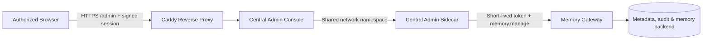

# Central Admin Console

The admin console runs on the same FN environment as the Gateway, Worker, and metadata store — not tied to any one Windows PC. Device status, reviews, dead letters, and activity are all read from a single service boundary. A local loopback admin page is still available for offline maintenance.



The console never connects to the database directly and never stores Gateway tokens, credentials, or private keys. All access goes through the Sidecar to existing Gateway authorization endpoints.

## Page Features

The admin page has six tabs:

**Overview** — Four metric cards: pending reviews, retryable events, dead letters, and active devices. Priority tasks and last-hour activity preview below.

**Memories** — Shows all shared memories for the workspace by default (no query required). Each entry shows source device/Agent, lifecycle status (active/superseded/archived), and confidence. Superseded memories show their replacement reference. Type two or more characters to search.

**Graph** — Canvas-rendered entity relationship network. Memory nodes are blue, devices orange, Agents purple. Edges show "originated from" connections; dashed edges represent superseded old facts. Archived memories are semi-transparent.

**Reviews** — Pending review candidates. Actions: confirm, confirm with edit, retain both, supersede, or reject. Every action needs an explicit confirmation checkbox.

**Devices & Permissions** — All registered devices with online indicators. A green dot means the device was seen within the last five minutes; grey means offline. Expand each row to adjust workspace capabilities.

**Runtime** — Sync delivery status, retryable events, and dead letters. Read-only; no auto-replay or deletion.

**Activity** — Audit records. Search by device, Agent, or action. Filter by result tone. Paginated at 10/20/50 per page with prev/next controls. Click a `gbrain:fact:xxx` target reference to jump to the linked memory detail.

## Initial Setup

Deploy a Gateway release that includes `deploy/fn/admin-console.compose.yaml`. Confirm Gateway, Worker, and proxy are healthy. Then run a dry-run from Windows:

```powershell
.\scripts\setup-central-admin.ps1 `
  -SshHost "deploy-user@nas" `
  -SshPort 22 `
  -RemoteRoot "/srv/memory-gateway" `
  -StateDirectory "/srv/memory-gateway/admin" `
  -TenantId "tenant" `
  -UserId "administrator" `
  -DeviceId "memory-admin" `
  -AgentInstallationId "memory-admin" `
  -DefaultWorkspace "shared-workspace" `
  -PublicBaseUrl "https://memory-gateway.internal:8443/admin"
```

The dry run checks Gateway, release, Docker networks, target directories, and existing containers — no identities, credentials, or container changes. Add `-Apply` after reviewing the output. First run will:

- Register an independent central admin device and Agent with workspace-scoped capabilities (includes `memory.manage` by default).
- Write device key, refresh credential, and Sidecar key to a protected directory (`0600` permissions). These are never printed or committed to Git.
- Start only the `admin-sidecar` and `admin-console` containers. Hermes, databases, and existing Bridges are untouched.

If admin identities or containers already exist, the script refuses to overwrite. Use `-Resume` explicitly.

## Opening the Page

The fixed entry point is the configured HTTPS URL, e.g. `https://192.168.100.144:8443/admin/`. After initial authorization, the session is valid for 30 days. Container restarts do not invalidate it.

When the session expires or you switch browsers:

```powershell
.\scripts\open-central-admin.ps1 `
  -SshHost "deploy-user@nas" `
  -RemoteRoot "/srv/memory-gateway" `
  -StateDirectory "/srv/memory-gateway/admin"
```

The script recreates the `admin-console` container, generates a one-time launch link, and hands it to the default browser. The link never appears in PowerShell output, logs, or Docker output. The first request exchanges it for a signed, expiring `HttpOnly`, `Secure`, `SameSite=Strict` cookie scoped to `/admin`. The signing key lives in an owner-only file in the central state directory.

Without a valid cookie, the page shows "Authorization required for this browser" instead of a JSON error.

## Network & Permissions

- Caddy is the only entry point exposed to browsers. `admin-console` has no host port; `admin-sidecar` RPC listens only on loopback.
- Access `/admin` only from the internal network or VPN. Do not expose it publicly or disable TLS.
- The admin identity is separate from Codex and Hermes identities. All share the same device registration and workspace authorization model.
- The page does not display public keys, credentials, connection strings, tokens, or memory ciphertext.
- The devices page supports capability adjustments, Agent revocation, and device revocation. Changes require secondary confirmation and current authorization epoch. The admin cannot revoke itself or remove its own `memory.manage`.
- Revocation only invalidates identity and credentials — it does not delete memories, device records, or audit entries. Recovery requires re-registration or pairing.

## Verification

1. Gateway, Worker, proxy, and `admin-sidecar` are all healthy/running.
2. Authorize via the open script; close the page, then visit the fixed URL directly without re-running the script.
3. All seven tabs — Overview, Memories, Graph, Reviews, Devices, Runtime, Activity — load and are interactive.
4. The Memories tab shows all shared memories by default, with source device, Agent, and lifecycle status.
5. Active devices show a green dot; offline devices show a grey dot.
6. Activity pagination works; clicking a `gbrain:fact:` reference jumps to the linked memory.
7. The Graph tab renders the memory-device-Agent relationship network with dashed supersede edges.
8. Verify one permission change and one review confirmation, then confirm the audit log records both.
