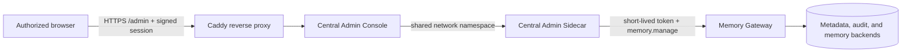

# Central Admin UI

Run the production admin UI beside the shared-memory center: the same environment that hosts the Gateway, Worker, and metadata storage. Device status, reviews, dead letters, and activity then come from one service boundary. The local loopback console remains available as a fallback for offline maintenance.



The browser reaches only Caddy's `/admin` path. The console does not connect to the database and does not hold Gateway tokens, refresh credentials, or device private keys; it calls the existing authorized Gateway interfaces through the central admin Sidecar.

## First setup

First deploy a Gateway release containing `deploy/fn/admin-console.compose.yaml` and confirm the Gateway, Worker, and proxy are healthy. Then run this read-only preflight from Windows:

```powershell
.\scripts\setup-central-admin.ps1 `
  -SshHost "deploy-user@nas" `
  -SshPort 22 `
  -RemoteRoot "/srv/memory-gateway" `
  -StateDirectory "/srv/memory-gateway/admin" `
  -TenantId "tenant" `
  -UserId "administrator" `
  -DeviceId "memory-admin" `
  -AgentInstallationId "memory-admin" `
  -DefaultWorkspace "shared-workspace" `
  -PublicBaseUrl "https://memory-gateway.internal:8443/admin"
```

The preflight checks the Gateway, release copy, Docker network, target directory, and existing central-admin containers only. It does not create identities, write credentials, or replace containers. After reviewing the output, add `-Apply` to the same command. The first apply registers a separate central admin device and Agent, writes its device key, refresh credential, and Sidecar key to protected owner-only locations, and starts only `admin-sidecar` and `admin-console`. Most Linux filesystems show this as `0600`; some NAS mounts report the equivalent owner-only mode as `0700`.

If a central identity or admin container already exists, the script stops by default. Add `-Resume` only after confirming that those two admin containers may be replaced.

## Open the UI

Use the fixed HTTPS address configured during deployment, such as `https://memory-gateway.internal:8443/admin/`. After one browser authorization, that address opens directly for the next 30 days. Restarting the `admin-console` container does not invalidate the session.

Run the opening script once for a new browser, after authorization expires, or after the session key is intentionally rotated:

```powershell
.\scripts\open-central-admin.ps1 `
  -SshHost "deploy-user@nas" `
  -SshPort 22 `
  -RemoteRoot "/srv/memory-gateway" `
  -StateDirectory "/srv/memory-gateway/admin"
```

The script recreates only `admin-console`, obtains a one-time authorization link, and hands it directly to the default browser. The link is not echoed to PowerShell, the operations log, or Docker logs. The first request exchanges it for a signed, expiring `HttpOnly`, `Secure`, `SameSite=Strict` cookie scoped to `/admin`. The signing key stays in an owner-only file in the central state directory; it never reaches the browser, logs, or Git.

Without a valid cookie, the fixed address shows a clear browser-authorization page instead of a raw JSON error. Do not disable authentication or open the admin path to every LAN client just to remove the initial authorization step.

## Network and authorization boundary

- Caddy is the only browser-facing entry. `admin-console` has no host port, and the admin Sidecar RPC listens only on container loopback.
- Access `/admin` only from the LAN or a VPN boundary. Do not publish it to the public Internet or disable TLS validation.
- The central admin identity is separate from Codex and Hermes identities. It uses the same device registration and workspace authorization model, so no machine-specific management implementation is needed.
- The UI displays only authorized device, capability, status, time, event reference, and audit metadata. It does not display raw public keys, refresh credentials, connection strings, tokens, or ciphertext.
- The device page can update the supported capabilities for the current workspace, revoke an Agent, or revoke a device. Changes require a second confirmation and the current authorization version. The active admin cannot revoke itself or remove its own `memory.manage` capability.
- Revocation invalidates identity and credentials but does not delete memories, device records, or audit history. Restoring access requires registration or pairing again.

## Acceptance

1. Gateway, Worker, proxy, and `admin-sidecar` are healthy or running.
2. Authorize the browser once through the opening script, close the page, and then open the fixed `/admin/` address directly.
3. Verify Overview, Reviews, Devices, Runtime, and Activity, and confirm that the content area expands with the browser width.
4. Confirm that Activity shows friendly source device and Agent information while keeping technical identifiers collapsed.
5. Use a non-admin test Agent to verify one workspace capability change, including concurrency protection and audit output. Run revocation checks only with an identity that can be paired again.
6. Verify a deliberately confirmed review action reaches the Gateway audit trail. Do not add deletion, batch cleanup, or automatic replay to the UI.

If the central entry is unavailable, check Caddy, `admin-sidecar`, and Gateway authorization before running the opening script again. Do not bypass the path by connecting the browser to the database or by editing Hermes configuration storage.
