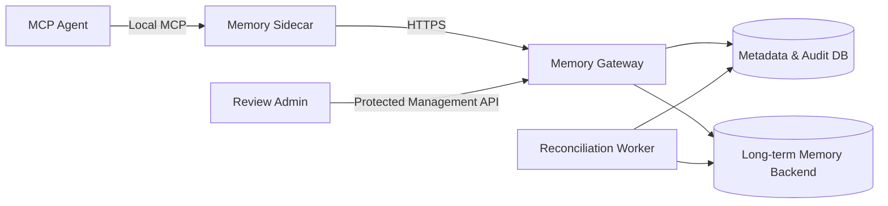
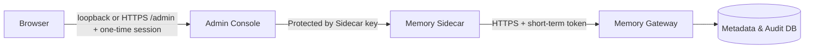

# Multi-Agent Shared Memory System Design

Suitable for Agents supporting MCP or HTTP, scalable from single-machine prototype to multi-device self-hosted deployment.

This document only describes reusable system design. Domain names, IPs, accounts, database addresses, certificate fingerprints, site records, and keys must not be written here.

## From Experience to Formal Integration

The repository provides two entry points:

- **Local experience script**: SQLite + temporary principal, two Agents cross-agent retrieval, data stays local.
- **Formal integration**: Device binding, Sidecar, HTTPS, registered workspace connection to shared service.

Both entry points follow the same identity, workspace, audit, and retrieval rules. The former does not assume cross-device security and high availability responsibilities; the latter uses PostgreSQL metadata database, encrypted outbox, and explicit migration workflow. See [Quick Start](quickstart.md) and [Deployment Guide](deployment.md) for specific operations.

---

### Setup Wizard Consolidates Steps, Does Not Skip Confirmations

`scripts/setup-shared-memory.ps1` provides five modes:

| Mode       | Purpose                        |
|------------|--------------------------------|
| `demo`     | Local experience               |
| `server`   | Publish a prepared server version |
| `device`   | Pair Windows device and connect to Sidecar |
| `container`| Container-side Sidecar setup    |
| `verify`   | Check if local Sidecar is running |

`device` mode reads the one-time pairing code from hidden input, creates device private key and Sidecar key, refreshes credentials and stores them in Windows Credential Manager. By default it creates an isolated Python runtime environment; after startup it generates only an MCP JSON without credentials. Stops when existing private key, key, scheduled task, or MCP configuration is found — it will not overwrite. If pairing succeeds but subsequent local steps are interrupted, the user can pass `-UseExistingCredential` to continue; the script only reuses existing credentials from protected storage, never reads, replaces, or outputs them.

`server` mode without `-Apply` only echoes validated publishing information. Adding `-Apply` creates the publish directory, uploads public code, and starts containers. Keys, certificates, database migrations, and backups are not within automation scope: these actions require administrator confirmation during maintenance windows.

---

## What Enters the Shared Store

The shared store holds long-term information: confirmed preferences, project decisions, device facts, reviewed workspace knowledge. Each record carries a source, associated workspace, status, and audit information.

The following stays in place: full Agent session logs, project files, tool execution state, model immediate context. The system does not automatically precipitate all chat content as long-term memory.

Clients read and write data through the Gateway and must not connect directly to the database. Deployment does not depend on any specific Agent vendor, public cloud service, or third-party vector API.

---

## How a Memory Flows Through the System



### Component Responsibilities

| Component        | Daily Work | Boundary |
|------------------|------------|----------|
| MCP Agent        | Calls memory tools, passes results to current task | Does not store Gateway credentials, does not connect to database directly |
| Sidecar          | Manages local authentication, encrypted outbox, cache, offline sync | One per device, shared by multiple Agents |
| Gateway          | Verifies identity, evaluates permissions, receives events, retrieval and review interfaces | Does not store full session history |
| Worker           | Retries, cross-store reconciliation, dead-letter handling, background crystallization | No interface exposed to Agents |
| Metadata DB      | Bindings, event ledger, receipts, review, sync status, audit | Does not serve as chat log store |
| Long-term Memory Backend | Confirmed memories, retrieval index, references | Does not handle identity auth or public-facing entry points |

The Sidecar is the sole local state owner per device. Multiple Agents on the same device share one Sidecar, preventing two processes from maintaining offline queues simultaneously.

The Sidecar specifies a default workspace at startup. MCP tools without a `workspace_id` use this value; it does not bypass the Gateway's workspace authorization for the caller.

---

### Same Access Protocol Covers Different Devices

Device access is divided into two layers:

- **Protocol layer**: Pairing, device private key, credential refresh rotation, workspace binding, offline queue, MCP tools. Behavior does not vary by device brand or Agent vendor.
- **Runtime layer**: Local credential storage and process lifecycle. Windows uses Credential Manager + scheduled tasks; containers use a state directory with permissions `0600` + loopback MCP Bridge.

The container Bridge shares the network namespace with the target service, with the standard address fixed at `http://127.0.0.1:8767/mcp`. Only the Agent's official MCP configuration entry point needs adaptation — no need to reimplement the memory service. The configuration connector must not save refresh credentials, operate the database, or expand workspace permissions.

---

## Who Can See Which Memories

### System Identifies the Caller

A valid principal is determined by the combination of these boundaries: tenant, user, device, Agent installation instance, workspace. Fields in the request body only express intent and cannot serve as the sole basis for authorization.

Initial registration uses a one-time pairing code + device public key to complete binding. The device proves private key possession with **Ed25519**; the Gateway issues short-term access tokens, with refresh credentials stored only in OS-protected local storage. The pairing code never appears in the command line, PowerShell history, or MCP JSON. When a device or Agent is revoked, the corresponding epoch is incremented, immediately invalidating old tokens and old sync state.

### Decision Order for Each Request

1. Verify caller identity and token (SHA-256 token hash, O(1) lookup).
2. Determine visible workspaces based on registered binding relationships.
3. Apply workspace filtering before retrieving candidates.
4. Management capabilities (review, revocation, crystal rebuild) are granted separately.
5. All authorization failures record auditable metadata (no body content).

Forging `user_id`, `device_id`, or `workspace_id` does not expand permissions.

---

## The Lifecycle of a Memory from Submission to Change

```
Event Submission
  -> Sensitive Content & Injection Check (SensitiveContentScanner)
  -> Idempotency Ledger (based on event_id)
  -> Confirmed Write or Review Candidate
  -> Long-term Memory Backend
  -> Authorized Retrieval
  -> Feedback, Forgetting, Archival, or Compensatory Revocation
```

### Duplicate Sending Does Not Duplicate Storage

Each write event has a stable event ID, source, scope, and timestamp. The Gateway first persists the event and its processing status, then generates domain effects. Re-submitting the same event returns the fixed receipt from the first submission, without re-writing the fact or re-counting.

Cross-database writes do not assume distributed transactions. The metadata DB first records pending events; the Worker writes to the long-term memory backend through retryable, reconcilable steps and backfills stable references. Failed events are retried with a backoff strategy; those exceeding the limit enter a dead-letter queue.

---

### When in Disagreement, Review First

Ordinary observations form candidates by default and do not immediately become shared facts. Explicit user decisions or authorized automated sources may enter the confirmed path.

The system compares scope, semantic key, time boundaries, and source; when a potential conflict is detected, a review is requested. A review operation requires `revision` (to prevent old pages from overwriting new state) + `idempotency_key` (to prevent duplicate submissions). Revocation is not deletion of history — it appends a compensatory record. Keeping both sides, superseding, archiving, or rejecting must all record the source and rationale.

---

### Crystalized Memories

A crystallized memory is a reconstructable summary page that compresses multiple stable facts into high-value context. Each page has its own input references and version. When any input changes, it is marked as stale; a new version is generated only through explicit rebuild.

Implementation is in `crystal_service.py`: `rebuild()` collects active facts corresponding to the `scope_binding_hash`, calling `gbrain.rebuild_crystal()` to generate a new summary page.

---

## Retrieving and Forgetting Memories

Retrieval pipeline: authorization filtering → candidate recall → deduplication and reranking → token budget trimming → structured return. Returned items include memory ID, source, time, status, and trace information, allowing the Agent to explain "why this memory was seen."

### Determine What Can Be Seen First, Then Sort

The Gateway retrieves the current caller's visible fact references from the metadata database, then reads those facts. The backend does not participate in permission decisions.

Once in the candidate set, three types of signals are compared simultaneously:

- Lexical word matching (lexical)
- Chinese character unigram and adjacent bigram features + local hash vector (vector)
- Memory inherent confidence (confidence)

**Retrieval Formula** (`hybrid_retrieval.py:187`):

```
base_score = confidence                        # no query
base_score = 0.50*lexical + 0.35*vector_score + 0.15*confidence  # with query
```

Records with identical content or vector cosine ≥ 0.94 are kept as one. Then proceed with **MMR Re-ranking** (`hybrid_retrieval.py:222`):

```
mmr_score = 0.80 * base_score - 0.20 * similarity + group_bonus
```

`group_bonus = 0.04` when the candidate and already-selected content are not in the same `scope:kind` group. Prevents consecutive memories with similar meaning.

---

### Context Budget

`max_tokens` for `memory_context`:

- Range: **64 – 12,000**
- Default: **1,200**

(Defined in `hybrid_retrieval.py:19-21`)

Budget calculation: Chinese characters are counted per character; English consecutive alphanumeric characters are counted approximately every three characters; each reference incurs a fixed overhead. The estimated total of selected content must not exceed the value given by the caller; candidates that do not fit are skipped, and the result is marked as `incomplete`.

Fixed safety instructions and return fields are not counted toward the budget. The returned result includes `token_estimate`, `token_budget`, and `retrieval` metadata.

---

### Forgetting and Scoring

Forgetting is not simple deletion by time. The system scores based on the combined signals (`scoring.py:51-67`):

```
score = relevance × confidence × importance × fresh × reinforcement × scope_match
```

Where `fresh` decays by half-life (`scoring.py:31-37`):

```
fresh = exp(-age_days / half_life_days)
```

**Half-life defined by memory type** (`scoring.py:9-16`):

| Type        | Half-life (days) |
|-------------|------------------|
| preference  | 180              |
| fact        | 90               |
| task_state  | 14               |
| temporary   | 3                |
| procedure   | 365              |
| device_fact | 120              |

Deletion or archival produces a tombstone and a sync epoch; offline old devices cannot re-upload forgotten content.

---

## Offline Device Handling

The Sidecar stores pending content in an **encrypted outbox** (`outbox.py` + `crypto.py`: AES-GCM encryption, AAD bound to event ID). When the network is available, it pushes in batches and pulls remote changes via opaque cursor; when the network is unavailable, it only accepts local encrypted writes. After recovery, alignment is performed using device sequence number, event ID, sync epoch, and final-status receipts.

Offline queries take candidates from the authorized encrypted cache and pending events, using the same set of Chinese-character matching, deduplication, reranking, and budget rules. Returned results carry `offline` and `incomplete` flags.

Offline sync rules:

- The local queue does not store plaintext sensitive memories.
- Must not fall back to unprotected public network addresses due to temporary disconnection.
- Clearing synced ciphertext requires explicit user confirmation.
- Two Sidecar processes must not hold the same outbox simultaneously.

---

## Sensitive Information and Suspicious Instructions

Writes and returns pass through a security gate (`SensitiveContentScanner`, `security.py:166`):

- Before persistence, identify high-risk content such as passwords, tokens, private keys, and connection strings. On rejection, only an irreversible HMAC fingerprint is retained for diagnostics.
- Memory content and system instructions are strictly isolated. Command-like or suspicious content is returned as data, not elevated to executable instructions.
- Logs, audits, and error messages record only necessary metadata, not keys, content, or recoverable credentials.
- Keys are separated by purpose: event encryption, token signing, refresh replay protection, outbox encryption, rejection fingerprint — they must not be reused.

---

## Database Migration and Disaster Recovery

SQLite is suitable for local demonstrations. Production uses a PostgreSQL metadata database + an independent long-term memory backend. The runtime account has only the minimum business permissions; the migration account is used only for schema changes; the Gateway does not automatically alter the database structure at startup.

Migration sequence (`migrate.py`):

1. `--check`: Read-only check of version, extensions, tables, indexes, permissions.
2. `--apply`: Backup + manual confirmation, then execute new migrations.
3. `--verify`: Confirm schema version, permissions, and runtime checks all pass.

Registered migration files must not be modified, only added. During recovery, first restore the metadata database and long-term memory backend, then perform reconciliation via the event ledger, receipts, and backend references.

---

## Deployment Layout

Containerized deployment includes at least Gateway, Worker, and HTTPS reverse proxy. The database is only reachable within the internal network; externally, only the protected Gateway or management entry is exposed. LAN clients connect directly to the internal HTTPS address; external clients access the same security boundary through VPN, zero-trust network, or controlled tunnel.

Deployment files, sample configurations, and documentation contain only variable names and placeholders. Environment files, certificates, private keys, principal configurations, database snapshots, site logs, and release records must remain in local protected locations, excluded by `.gitignore`.

---

## Admin Console Access

The admin console is only available to registered Agents with `memory.manage`. The browser does not directly store Gateway tokens, refresh credentials, or database connection strings. The default local entry uses a loopback management bridge; production may run the same console beside the Gateway and expose `/admin` through Caddy plus a dedicated admin Sidecar. Both paths forward requests through the Sidecar, and browser pages, MCP, and automation scripts share the same device identity and workspace authorization model.



The local management bridge listens on **127.0.0.1**. A central console may listen behind Caddy only when an explicit network opt-in, fixed `/admin` mount, and `Secure` cookie are enabled; it has no host port. Each start generates a one-time session. The first browser request exchanges it for an `HttpOnly`, `SameSite=Strict` cookie; for the central entry, the launch link is written only to a protected file and never appears in page source or Docker logs. The management bridge does not read the database and does not store Gateway credentials. See [Central Admin UI](central-admin.md).

---

The admin page is divided into six sections:

- **Overview**: Pending reviews, pending retries, dead letters, and active device count for the current workspace. Health checks and recent activity requiring attention are placed together. When the Sidecar is not updated or the Gateway is unavailable, the page provides recovery hints and does not show a skeleton screen.
- **Memories**: Only calls the current Agent's authorized retrieval through the Sidecar. After the user enters keywords, authorized memories, source type, status, and confidence are displayed. Does not provide new creation, deletion, or batch modification bypassing review.
- **Devices & Permissions**: Shows device, Agent, workspace bindings, capabilities, status, authorization epoch. Does not display device private keys, refresh credentials, raw public keys, or credential hashes.
- **Review & Conflicts**: Reuses the review interface. First shows candidates and conflict sources; requires explicit user confirmation before executing confirm, supersede, keep both, reject, or revoke. Each operation uses `revision` + `idempotency_key`.
- **Operations**: Error codes and recovery check results for pending retries and unprocessed dead letters. Read-only.
- **Activity**: Recent audit log. Read-only.

Gateway management interfaces uniformly require `memory.manage`, filtered by the caller's tenant, user, and workspace. Only structured metadata (status, count, time, ID, error code) is returned. Candidate content is decrypted by the existing review service according to authorization; audit and operations interfaces do not return content, ciphertext, tokens, connection strings, or exception stack traces.

Management entry points are read-only by default. Requests that change memory state use the review interface, requiring `confirmed_by_user=true`, the expected revision, and a one-time idempotency key. Deletion, cleanup, and batch replay are not included in the default console operation scope.

---

## Launch Checklist

- Multiple authorized Agents can read and write memories in the same scope.
- Unauthorized principals cannot access other devices' or workspaces' content by forging fields.
- Replaying the same event multiple times produces only one domain effect and the same final receipt.
- Offline writes are not lost, not duplicated, and not written to disk in plaintext after recovery.
- Conflicts enter review; review, revocation, forgetting, and crystal rebuild are all traceable.
- Keys, tokens, connection strings, and private keys do not appear in Git, logs, MCP configuration, or long-term memory.
- Upgrades and disaster recovery can be verified through migration checks, health checks, and reconciliation tasks.

For specific commands and release checklists, see [Deployment Guide](deployment.md).
