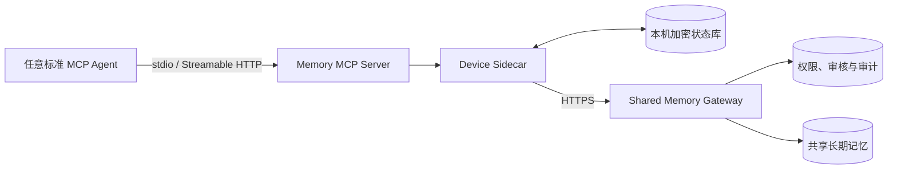

# 本地增强记忆后续可行性与实施报告

> 更新日期：2026-08-13
> 基线：`main` 分支提交 `75a6d96`，PR #43 已合并
> 实施分支：`mcp-memory-lifecycle-optimization`

## 一、结论

这套系统可以继续增强，但不应给 Codex、Hermes、OpenClaw 分别维护一套业务适配。基础接入统一使用标准 MCP：Agent 主动查询上下文、保存任务检查点、恢复任务和提交长期记忆。Sidecar 负责本机加密状态，Gateway 继续处理共享、权限、审核、同步和审计。

当前分支已经完成第一轮低侵入实现：

| 优先级 | 能力 | 当前状态 |
|---|---|---|
| P0 | 通用 `memory_checkpoint` / `memory_resume` | 已实现，本机加密，不读取 Agent 私有会话 |
| P1 | 本机分层记忆 | 已实现摘要骨架和完整详情两层按需恢复 |
| P2 | 一致性诊断 | 已纳入 `memory-device doctor` |
| P3 | 后台结晶候选 | 已实现，只规划候选，不自动重建 |
| P4 | 衰减影子模式 | 已实现，只观察，不影响正式排序 |

这条路线对现有功能影响小。它复用 Sidecar、AES-GCM、本机 SQLite、Worker、MCP 和现有权限体系，没有新增常驻服务，也没有引入本地模型或第三方向量服务。

## 二、目标和边界

### 2.1 用户体验

用户仍然只安装一次。任何支持标准 MCP 的 Agent 连接同一个 `shared-memory` 服务，不需要安装该 Agent 专属的记忆插件。

正常使用流程：

1. 开始任务时调用 `memory_context` 获取共享长期记忆。
2. 继续中断任务时调用 `memory_resume` 获取本机最近检查点。
3. 工作形成稳定阶段时调用 `memory_checkpoint` 保存当前结论、下一步和阻塞项。
4. 只有真正有长期价值的内容才调用 `memory_remember`，进入原有共享审核和同步流程。

### 2.2 明确不做的事

- 不扫描 Agent 的私有数据库、聊天记录或 transcript。
- 不自动接管 Agent 自带的记忆系统。
- 不默认修改第三方客户端配置。
- 不把完整会话上传到 Gateway。
- 不让衰减曲线直接删除、归档或改变正式排序。
- 不让 Worker 自动重建结晶页。
- 不把 Codex、Hermes、OpenClaw 名称写进核心业务分支判断。

Agent 专属 hook 将来可以用来提高会话结束或压缩前自动保存的成功率，但它是可选增强，不是安装、运行和验收的前提。

## 三、架构



正式集成面只有 MCP。不同客户端的 JSON 外壳可以不同，但业务工具和数据契约相同。

### 3.1 本机职责

Sidecar 负责：

- 保存任务检查点。
- 按需恢复摘要或详情。
- 离线写入、授权缓存和同步。
- 敏感信息检查。
- 本机数据库完整性检查。

### 3.2 中枢职责

Gateway 和 Worker 负责：

- 身份、工作区和能力授权。
- 长期记忆写入、审核、冲突和撤销。
- 跨设备同步和固定回执。
- 共享检索和召回反馈。
- 发现需要重建的结晶候选。

本机检查点不自动进入中枢。需要共享时，Agent 应从检查点中选出长期结论，再显式调用 `memory_remember`。

## 四、已实现能力

### 4.1 通用 MCP 检查点和恢复

新增两个核心工具：

```text
memory_checkpoint
memory_resume
```

`memory_checkpoint` 接收结构化状态：

- `summary`：当前任务结论。
- `next_steps`：下一步。
- `blockers`：阻塞项。
- `decisions`：已经作出的决定。
- `references`：代码、文档或其他不透明引用。
- `metadata`：可序列化的附加信息。

服务端不读取 Agent 会话，只保存 Agent 主动提交的数据。保存前执行敏感信息扫描，命中令牌、密码、私钥或连接串时拒绝落库。

`memory_resume` 默认只返回摘要、下一步和阻塞项。调用方明确传入 `include_details=true` 后，才解密并返回决定、引用和元数据。

### 4.2 本机分层加密

本机 SQLite 新增 `local_checkpoints_v1`。摘要和详情分别使用 AES-GCM 加密，并使用工作区、检查点 ID 和层级构造 AAD。

主键是 `(workspace_id, checkpoint_id)`，相同检查点名称可以安全地存在于不同工作区。更新同一检查点会保留创建时间并推进更新时间。

字段和行为限制：

- 检查点 ID 只接受有限字符和长度。
- 摘要最长 4,000 字符。
- 每类列表最多 50 项，单项最长 2,000 字符。
- 完整详情序列化后最多 64 KiB。
- 元数据必须是 JSON 可序列化对象。

### 4.3 doctor 一致性检查

`memory-device doctor` 在 Sidecar 健康时增加 `local_memory_integrity` 检查：

- SQLite `PRAGMA quick_check`。
- 必需表是否存在。
- outbox 各状态计数。
- 最近少量 outbox 密文是否可以通过 AAD 完整解密。

检查通过本机回环 RPC 执行，不直接打开正在由 Sidecar 持有的数据库，因此不会制造第二个写者或绕过进程锁。输出不含记忆正文和密文。

### 4.4 结晶重建候选

元数据库新增 `crystal_rebuild_candidates`。常驻 Worker 启动后立即检查一次，之后默认每 300 秒检查同一授权范围内的已确认、非命令式、活跃来源。可以通过 `--crystal-plan-interval-seconds` 调整周期；单次运行只检查一次。

以下情况会生成或更新候选：

- 该范围至少有两条来源，但没有结晶页。
- 现有结晶页已经 stale。
- 来源修订号高于结晶页生成修订号。

候选只保存：

- 工作区和授权范围。
- `scope_binding_hash`。
- `namespace_key`。
- GBrain 来源引用列表。
- 来源数量和最新修订号。
- 原因和候选状态。

候选不保存记忆正文。`memory_list_crystal_candidates` 只读列出候选；`memory_rebuild_crystal` 仍由用户或管理员显式调用。成功后候选标记为 `rebuilt`，来源历史不删除。

### 4.5 衰减影子模式

正式召回继续使用现有混合检索、反馈调整、MMR 和 token 预算。当前顺序不变。

每条结果增加 `shadow_decay`：

```json
{
  "applied": false,
  "band": "hot",
  "multiplier": 0.92,
  "age_days": 7.0,
  "half_life_days": 90,
  "pinned_floor": false
}
```

观察档位为 `hot`、`warm`、`cold`、`dead`。固定记忆的影子倍率不低于 `0.85`。这些字段只用于收集效果数据，不参与正式排序，也不会触发生命周期变更。

## 五、安全与兼容性

### 5.1 安全边界

- 检查点沿用设备本机加密密钥，不新建明文数据库。
- 检查点不会自动同步到 Gateway。
- 工作区参与主键和 AAD，避免跨工作区误读或密文替换。
- 敏感信息在本机落库前拦截。
- 结晶候选只保存引用，不复制正文。
- doctor 只返回状态和计数。
- 衰减结果明确标记为未应用。

### 5.2 升级兼容

本机 SQLite 只追加新表，不修改现有 outbox、缓存和回执表。旧数据库首次由新版本 Sidecar 打开时自动创建检查点表。

中枢 PostgreSQL 使用新迁移 `2026-08-13.1` 创建候选表。运行新 Worker 前必须按原有迁移流程更新元数据库，否则 schema 校验会拒绝启动，避免代码在不完整表结构上运行。

### 5.3 降级兼容

不调用 `memory_checkpoint` 和 `memory_resume` 时，现有共享记忆行为不变。衰减只增加返回元数据，排序不变。结晶候选即使无人处理，也不会阻塞事件对账或自动修改长期记忆。

## 六、当前限制

### 6.1 MCP 调用不是强制生命周期事件

标准 MCP 没有统一的“会话即将结束”事件。Agent 是否按指令调用 `memory_checkpoint`，取决于客户端能力和模型行为。

因此基础版可以做到低侵入和通用，但不能承诺每次会话结束都自动保存。需要更高自动化率的客户端，可以以后增加可选 hook；核心功能不能依赖这些 hook。

### 6.2 检查点还不是完整本地长期记忆库

当前检查点适合恢复任务状态，不提供本地全文索引、版本浏览、保留期管理和用户界面。它也不会自动从多次检查点提炼本地长期事实。

### 6.3 结晶候选没有管理页入口

当前可通过 MCP 查看候选并显式重建。中枢管理页尚未提供候选列表、忽略和批量筛选界面。

### 6.4 衰减缺少真实评估样本

影子模式已经输出解释字段，但还没有长期真实召回数据来判断阈值是否合理。现在启用正式降权风险较高。

## 七、后续优先级

### P0：完成发布闭环

- 在管理页展示结晶候选。
- 为候选增加显式 `dismiss`，并保留新来源修订后重新激活的规则。
- 在升级说明中加入 `2026-08-13.1` 迁移步骤。
- 对 stdio 和 Streamable HTTP 各跑一套 MCP 合约测试。

验收：新旧设备升级后共享读写不变；候选操作可审计；不迁移时 Worker 明确拒绝启动。

### P1：检查点生命周期管理

- 列出当前工作区最近检查点。
- 显式归档检查点，不提供默认永久删除。
- 增加容量上限和保留期报告。
- doctor 报告检查点数量与最老、最新时间，不返回正文。

验收：长期运行时本机库大小可控，用户能找回指定任务，归档不会误删其他工作区。

### P2：本地检索与候选提炼

- 从用户明确选中的检查点生成本地长期记忆候选。
- 候选先在本机预览，确认后再复用 `memory.proposed` 共享。
- 复用现有敏感、命令式、重复和冲突检查。

验收：检查点和共享长期记忆职责清楚；原始详情不上传；重复提交只产生一条共享效果。

### P3：衰减评估

- 记录影子顺序和现有顺序的离线差异，不改在线结果。
- 按 `useful`、`pin`、`outdated`、`incorrect` 比较两种排序。
- 固定记忆、用户明确确认和结晶页保留最低权重。
- `dead` 只代表低召回优先级，不自动删除。

只有影子结果在足够样本上不降低正反馈率，才考虑按工作区灰度启用。

### P4：可选生命周期增强

如确实需要会话结束自动保存，可提供独立的、默认关闭的扩展包。扩展只调用标准 `memory_checkpoint`，不直接写数据库，不持有 Gateway 刷新凭据。

每个扩展必须满足：

- 移除扩展后核心 MCP 功能仍完整可用。
- 安装器不覆盖第三方已有配置。
- 扩展失败不阻塞 Agent 主流程。
- 不上传 transcript 或本地路径。

## 八、测试与验收

本轮改动需要持续覆盖：

- 检查点正文不出现在 SQLite 明文。
- 摘要层和详情层按需解密。
- 工作区隔离和 ID 校验。
- 敏感检查点在落库前被拒绝。
- Sidecar RPC 方法白名单。
- doctor 健康和异常结果。
- 结晶候选迁移、规划幂等和无正文契约。
- Gateway 权限路由。
- 衰减固定下限与 `applied=false`。
- 既有同步、审核、安装、修复、卸载和跨平台测试。

发布前最低验证：

```powershell
python -m pytest tests -q
python -m compileall -q src tests
git diff --check
```

有可用的 PostgreSQL 和 GBrain 隔离环境时，再执行真实迁移、Worker 候选规划、结晶重建和同步回归。

## 九、风险判断

| 风险 | 可能性 | 影响 | 处理方式 |
|---|---|---|---|
| Agent 忘记调用 checkpoint | 中 | 中 | MCP instructions 提示；保留手动调用；可选 hook 以后再做 |
| 检查点混入敏感信息 | 低至中 | 高 | 本机扫描、大小限制、AES-GCM、默认不上传 |
| 本机数据库长期增长 | 中 | 中 | 下一阶段增加容量与保留期报告 |
| 候选数量过多 | 中 | 低 | Worker 有单轮上限；范围唯一；无自动重建 |
| 衰减阈值不适合真实使用 | 高 | 中 | 仅 shadow；不改排序；收集反馈后再决定 |
| 新 Worker 连接旧 schema | 中 | 高 | schema 校验 fail-closed，必须先迁移 |

## 十、最终建议

继续采用 MCP-first 方案。核心服务保持一个协议、一套工具和一份数据契约，不按 Agent 品牌分叉。

这次实现已经把恢复任务、分层读取、一致性诊断、结晶候选和衰减评估接入现有架构，同时保留原有共享记忆行为。下一步先完成发布闭环和真实环境迁移验证，再考虑本地检索、候选提炼或可选生命周期 hook。

仓库继续保持一个产品：

```text
agent-memory-gateway
├─ Shared Memory Core
├─ Device Sidecar
│  ├─ MCP tools
│  ├─ Encrypted outbox/cache
│  └─ Layered local checkpoints
└─ Gateway Worker
   ├─ Event reconciliation
   └─ Crystal candidate planning
```

暂时不拆仓，也不增加独立 Local Engine 进程。只有本地索引或模型提炼带来明显的资源隔离需求时，再评估拆进程；这不影响 MCP 接入契约。
